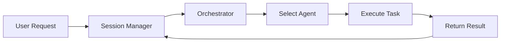
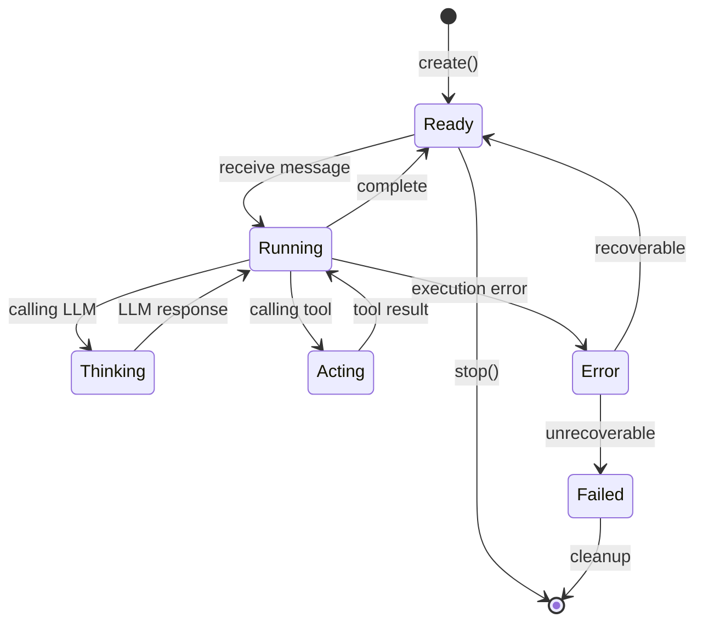
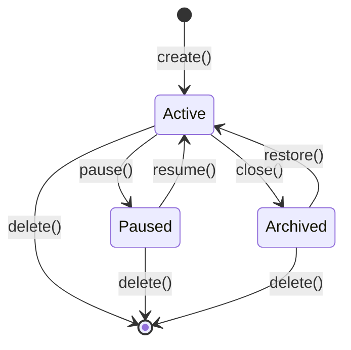

# Knight-Agent 系统设计文档

## 1. 系统架构

### 1.1 整体架构

```
┌─────────────────────────────────────────────────────────────────┐
│                         用户接口层                               │
├─────────────────────────────────────────────────────────────────┤
│  CLI Interface  │  Web UI  │  REST API  │  WebSocket           │
└─────────────────────────────────────────────────────────────────┘
                              ↓
┌─────────────────────────────────────────────────────────────────┐
│                        核心引擎层                                │
├─────────────────────────────────────────────────────────────────┤
│  ┌──────────────┐  ┌──────────┐  ┌──────────┐  ┌──────────┐    │
│  │Session       │  │Orchestrat│  │ Router   │  │ Scheduler│    │
│  │Manager       │  │or        │  │          │  │          │    │
│  │              │  └──────────┘  └──────────┘  └──────────┘    │
│  │┌────────────┐│  ┌──────────┐  ┌──────────┐  ┌──────────┐  │
│  ││Session A/B ││  │ Monitor  │  │ Event    │  │  Hook   │  │
│  ││(并行)      ││  │          │  │ Loop     │  │  Engine  │  │
│  │└────────────┘│  └──────────┘  └──────────┘  └──────────┘  │
│  └──────────────┘                                         │    │
└─────────────────────────────────────────────────────────────────┘
                              ↓
┌─────────────────────────────────────────────────────────────────┐
│                        Agent 运行层                              │
├─────────────────────────────────────────────────────────────────┤
│  ┌──────────────┐  ┌──────────────┐  ┌──────────────┐          │
│  │ Agent 1      │  │ Agent 2      │  │ Agent N      │          │
│  │ ┌──────────┐ │  │ ┌──────────┐ │  │ ┌──────────┐ │          │
│  │ │Context   │ │  │ │Context   │ │  │ │Context   │ │          │
│  │ │Skill     │ │  │ │Skill     │ │  │ │Skill     │ │          │
│  │ │Tool      │ │  │ │Tool      │ │  │ │Tool      │ │          │
│  │ └──────────┘ │  │ └──────────┘ │  │ └──────────┘ │          │
│  └──────────────┘  └──────────────┘  └──────────────┘          │
│         ↓                  ↓                  ↓                  │
│  ┌─────────────────────────────────────────────────────┐        │
│  │            消息总线 / 协作通道                       │        │
│  └─────────────────────────────────────────────────────┘        │
└─────────────────────────────────────────────────────────────────┘
                              ↓
┌─────────────────────────────────────────────────────────────────┐
│                        基础服务层                                │
├─────────────────────────────────────────────────────────────────┤
│  ┌──────────┐  ┌──────────┐  ┌──────────┐  ┌──────────┐        │
│  │ LLM      │  │ MCP      │  │ Storage  │  │ Context  │        │
│  │ Provider │  │ Client   │  │ Service  │  │Compressor│        │
│  └──────────┘  └──────────┘  └──────────┘  └──────────┘        │
└─────────────────────────────────────────────────────────────────┘
                              ↓
┌─────────────────────────────────────────────────────────────────┐
│                        工具层                                    │
├─────────────────────────────────────────────────────────────────┤
│  File │ Grep │ Bash │ Git │ Edit │ Lint │ Test │ MCP Tools     │
└─────────────────────────────────────────────────────────────────┘
```

### 1.2 架构分层

| 层级 | 职责 | 核心组件 |
|------|------|----------|
| 用户接口层 | 用户交互 | CLI、Web UI、API |
| 核心引擎层 | 编排调度、会话管理、扩展钩子 | Session Manager、Orchestrator、Router、Scheduler、Hook Engine |
| Agent 运行层 | Agent 执行 | Agent、Context、Skill、Tool |
| 基础服务层 | 基础能力 | LLM Provider、MCP Client、Storage、Context Compressor |
| 工具层 | 具体操作 | 文件、搜索、命令、Git 等 |

---

## 2. 核心组件

### 2.1 Session Manager (会话管理器)

**职责**: 会话生命周期管理、Workspace 隔离、上下文压缩、历史持久化

```yaml
# Session Manager 接口定义
session_manager:
  # 会话管理
  create_session:
    inputs:
      - name: string
      - workspace: string
    outputs:
      session_id: string

  get_session:
    inputs:
      - id: string
    outputs:
      session: object | null

  list_sessions:
    outputs:
      sessions: array

  delete_session:
    inputs:
      - id: string

  # 会话切换
  use_session:
    inputs:
      - id: string

  get_current_session:
    outputs:
      session: object | null

  # 上下文管理
  compress_context:
    inputs:
      - session_id: string
    outputs:
      compression_point: object

  search_history:
    inputs:
      - query: string
    outputs:
      messages: array

  # 持久化
  save_session:
    inputs:
      - id: string

  load_session:
    inputs:
      - id: string
    outputs:
      session: object
```

```yaml
# Session 数据结构
session:
  id: string
  name: string
  workspace:
    root: string              # 项目根目录
    allowed_paths: array      # 允许访问的路径 (沙箱)
    project_type: string      # rust/node/python
    git_info: object          # Git 信息
  context:
    messages: array           # 消息历史
    compression_points: array # 压缩点
    variables: map            # 会话变量
    agent_state: map          # Agent 状态
  status: string             # active/paused/archived
  created_at: datetime
  last_active_at: datetime
```

**会话隔离机制**:
```yaml
workspace_isolation:
  # 文件访问控制
  file_access_check:
    - resolve_path: absolute_path
    - check_allowed: path in allowed_paths
    - allow_or_deny: boolean

  # 会话间隔离
  session_boundary:
    - no_cross_session_file_access: true
    - independent_context: true
    - separate_history: true
```

### 2.2 Orchestrator (编排器)

**职责**: Agent 生命周期管理、任务编排、资源分配

```yaml
orchestrator:
  # Agent 管理
  start_agent:
    inputs:
      - id: string
      - config: object

  stop_agent:
    inputs:
      - id: string

  list_agents:
    outputs:
      agents: array

  # 任务管理
  submit_task:
    inputs:
      - task: object
    outputs:
      task_id: string

  get_task_status:
    inputs:
      - id: string
    outputs:
      status: string

  # 消息路由
  send_message:
    inputs:
      - to: string           # Agent ID
      - message: object

  broadcast:
    inputs:
      - message: object
```



### 2.3 Agent (代理)

**职责**: 执行指令、调用 LLM、管理上下文、调用工具

```yaml
agent:
  id: string
  definition:
    name: string
    role: string
    model:
      provider: string        # anthropic/openai/custom
      model: string
      temperature: float
      max_tokens: int
    instructions: string
    tools: array
    skills: array
    permissions: object
    variants: array           # 变体支持

  context:
    messages: array
    variables: map
    memory: array

  state: string              # idle/thinking/acting/error
```

### 2.4 Skill (技能)

**职责**: 定义可复用的行为模式、响应触发、执行流程

```yaml
skill:
  metadata:
    name: string
    description: string
    version: string
    category: string

  triggers:
    - type: keyword
      patterns:
        - "review"
        - "审查"
    - type: file_change
      patterns:
        - "**/*.ts"
      debounce: 500
    - type: schedule
      cron: "0 9 * * *"

  steps:
    - name: "收集文件"
      tool: "glob"
      args:
        pattern: "**/*.ts"
      output: "files"

    - name: "AI 分析"
      agent: "self"
      prompt: |
        分析以下文件：{{ files }}
      output: "analysis"

    - name: "生成报告"
      tool: "write"
      args:
        path: "reports/{{ timestamp }}.md"
        content: "{{ analysis }}"
```

### 2.5 Tool (工具)

**职责**: 执行具体操作、参数验证、权限检查

```yaml
tool:
  name: string
  description: string
  parameters:
    type: object             # JSON Schema
    required: array

  execute:
    inputs:
      args: object
    outputs:
      success: boolean
      data: any
      error: string | null
```

**内置工具**:
| 工具 | 功能 | 权限控制 |
|------|------|----------|
| Read | 读取文件 | Workspace 路径检查 |
| Write | 写入文件 | Workspace 路径检查 |
| Edit | 编辑文件 | Workspace 路径检查 |
| Grep | 搜索文本 | Workspace 路径检查 |
| Bash | 执行命令 | 命令白名单 |

---

## 3. 会话系统

### 3.1 在架构中的位置

```
用户请求
    │
    ▼
┌─────────────────────────────────────────────────────────────┐
│  Session Manager                                            │
│  ┌───────────┐ ┌───────────┐ ┌───────────┐ ┌───────────┐  │
│  │会话创建   │ │会话切换   │ │上下文压缩 │ │历史搜索   │  │
│  └───────────┘ └───────────┘ └───────────┘ └───────────┘  │
│  ┌─────────────────────────────────────────────────────┐   │
│  │  Workspace 隔离                                      │   │
│  │  - 每个 Session 独立的文件访问权限                   │   │
│  │  - 会话间完全隔离                                   │   │
│  └─────────────────────────────────────────────────────┘   │
└─────────────────────────────────────────────────────────────┘
                          │
                          ▼
┌─────────────────────────────────────────────────────────────┐
│  Orchestrator                                               │
│  - Agent 生命周期管理                                         │
│  - 任务调度                                                   │
│  - 消息路由                                                   │
└─────────────────────────────────────────────────────────────┘
                          │
                          ▼
┌─────────────────────────────────────────────────────────────┐
│  Agent                                                      │
│  - LLM 调用                                                   │
│  - Skill 执行                                                 │
│  - Tool 调用                                                  │
└─────────────────────────────────────────────────────────────┘
```

**关键设计原则**:
1. **会话隔离**: 每个会话有独立的 Workspace 和上下文
2. **并行执行**: 多个会话可以同时运行，互不干扰
3. **上下文管理**: 自动压缩长对话，保留关键信息
4. **状态持久化**: 会话状态可保存和恢复

### 3.2 多会话并行

```
Session Manager
    │
    ├── Session A (workspace: ~/project-frontend)
    │   ├── Agent: frontend-dev
    │   ├── Context: React 相关
    │   └── History: 独立的消息历史
    │
    ├── Session B (workspace: ~/project-backend)
    │   ├── Agent: backend-dev
    │   ├── Context: API 相关
    │   └── History: 独立的消息历史
    │
    └── Session C (workspace: ~/docs)
        ├── Agent: writer
        ├── Context: 文档编写
        └── History: 独立的消息历史
```

**隔离保证**:
- Session A 无法访问 Session B 的 workspace 文件
- 每个会话有独立的上下文和消息历史
- Agent 状态不跨会话共享

### 3.3 上下文压缩

```yaml
compression:
  # 触发条件
  trigger:
    message_count: 50
    token_count: 200000

  # 压缩策略
  method: summary          # summary/semantic/hybrid
  keep_recent: 20

  # 压缩点结构
  compression_point:
    before_count: int       # 压缩前的消息数
    after_count: int        # 压缩后的消息数
    summary: string         # 压缩摘要
    timestamp: datetime
    token_saved: int
```

**压缩流程**:
```
原始消息: [1, 2, 3, ..., 50, 51, ..., 70]
           ↓
    [检测超过阈值]
           ↓
    调用 LLM 生成摘要
           ↓
[压缩点摘要] + [51, ..., 70]
```

### 3.4 会话持久化

```
storage/sessions/
├── {session-id}/
│   ├── session.json          # 会话元数据
│   ├── messages.jsonl        # 消息历史 (追加写入)
│   └── compression/          # 压缩点缓存
│       ├── point_001.json
│       └── point_002.json
```

---

## 4. 数据模型

### 4.1 Agent 定义格式

```markdown
---
id: "code-reviewer"
name: "Code Reviewer"
version: "1.0.0"
---

# Agent: Code Reviewer

## Role
专业的代码审查助手

## Model
- provider: anthropic
- model: claude-sonnet-4-6
- temperature: 0.3
- max_tokens: 8192

## Instructions
检查代码的：
1. 安全性
2. 性能
3. 可读性
4. 最佳实践

## Capabilities
- read
- grep
- bash (lint)

## Permissions
**允许**:
- **/*.ts
- **/*.tsx

**拒绝**:
- **/node_modules/**
- **/.git/**
```

### 4.2 Agent 变体格式

```markdown
---
extends: AGENT.md
variant: quick
---

## Role
快速代码检查

## Model
- model: claude-haiku
- temperature: 0.1
- max_tokens: 4096

## Instructions
只检查：
1. 明显错误
2. 命名规范
3. 简单反模式
```

### 4.3 Skill 定义格式

```markdown
---
name: security-review
category: security
triggers:
  - type: keyword
    patterns: ["security", "安全"]
  - type: file_change
    patterns: ["**/*.ts"]
---

## Steps

### Step 1: 收集文件
```yaml
tool: glob
args:
  pattern: "**/*.ts"
output: files
```

### Step 2: 运行安全扫描
```yaml
tool: bash
args:
  command: npm audit
output: audit_results
```

### Step 3: AI 分析
```yaml
agent: self
prompt: |
  分析以下安全问题：
  {{ audit_results }}
output: security_issues
```

### Step 4: 生成报告
```yaml
tool: write
args:
  path: "reports/security-{{ timestamp }}.md"
  content: |
    # Security Report
    {{ security_issues }}
```
```

---

## 5. 协作机制

### 5.1 协作模式

**主从模式**:
```
Master Agent
    ├─→ Worker 1: 读取文件
    ├─→ Worker 2: 分析代码
    ├─→ Worker 3: 运行测试
    └─→ 汇总结果
```

**流水线模式**:
```
┌─────────┐    ┌─────────┐    ┌─────────┐    ┌─────────┐
│ Spec    │───→│ Design  │───→│ Code    │───→│ Test    │
│ Agent   │    │ Agent   │    │ Agent   │    │ Agent   │
└─────────┘    └─────────┘    └─────────┘    └─────────┘
```

**议题模式**:
```
    ┌────────────────────┐
    │   Shared Context   │
    └────────────────────┘
            ↑
    ┌─────┴─────┐
    │           │
Agent A ←── Agent B
    │           │
    └─────┬─────┘
          投票/共识
```

### 5.2 上下文共享

```yaml
context_manager:
  # 公共上下文 (协作 Agent 共享)
  shared:
    files: FileIndex
    tasks: TaskRegistry
    history: MessageHistory
    variables: map

  # 私有上下文 (每个 Agent 独立)
  private:
    agent_id:
      memory: array
      temp_files: array
      state: map
```

---

## 6. 事件驱动系统

### 6.1 事件类型

```yaml
events:
  file_event:
    type: file_created | file_modified | file_deleted
    path: string
    session_id: string

  git_event:
    type: git_commit | git_push
    branch: string
    hash: string

  schedule_event:
    type: schedule
    cron: string

  message_event:
    type: message
    content: string
    session_id: string
```

### 6.2 监听器模式

```yaml
listener:
  filter:
    event_type: string
    conditions: map

  on_event:
    - trigger_skill: string
    - send_message:
        to: agent_id
        content: string
```

---

## 7. Hook 系统

### 7.1 Hook 架构

Hook 系统允许插件在关键事件点注入自定义逻辑。

```
请求流程 with Hooks:
┌─────────────────────────────────────────────────────────────┐
│  before hooks (priority: 1 → N)                              │
│  ┌────────┐ ┌────────┐ ┌────────┐ ┌────────┐              │
│  │ Hook 1 │→│ Hook 2 │→│ Hook N │→│ 检查阻断│              │
│  └────────┘ └────────┘ └────────┘ │        │              │
│                                  └───┬────┘              │
│                                      │                     │
│                           ┌──────────┴──────────┐          │
│                           │ no block          │          │
│                           ▼                   │          │
│                    ┌────────────────┐         │          │
│                    │  执行原始操作   │         │          │
│                    └────────────────┘         │          │
│                           │                   │          │
│                           ▼                   │          │
│  ┌────────────────────────────────────────────────────────┤
│  │ after hooks (priority: 1 → N)                            │
│  │ ┌────────┐ ┌────────┐ ┌────────┐                         │
│  │ │ Hook 1 │→│ Hook 2 │→│ Hook N │                         │
│  │ └────────┘ └────────┘ └────────┘                         │
│  └────────────────────────────────────────────────────────┘
│                           │
│                           ▼
│                    返回结果
└─────────────────────────────────────────────────────────────┘
```

### 7.2 Hook 定义

```yaml
hook:
  name: string
  priority: int               # 执行优先级 (越小越先)
  phase: string               # before/after/replace

  # 触发条件
  trigger:
    event: string
    filter:
      agent: string | null
      session: string | null
      tool: string | null

  # 处理器
  handler:
    type: string              # command/skill/rpc
    target: string

  # 控制能力
  control:
    can_block: boolean
    can_modify: boolean
    continue_on_error: boolean
```

### 7.3 Hook 事件点

```yaml
hook_events:
  # Agent 生命周期
  agent:
    - agent_create
    - agent_created
    - agent_execute
    - agent_executed
    - agent_error

  # 会话生命周期
  session:
    - session_create
    - session_created
    - session_switch
    - session_close
    - context_compress

  # 工具调用
  tool:
    - tool_call               # 调用前 (可阻断)
    - tool_result             # 返回后
    - file_access             # 文件访问 (可阻断)
    - command_execute         # 命令执行 (可阻断)

  # LLM 调用
  llm:
    - llm_request
    - llm_response
    - prompt_build            # 可修改 prompt

  # 消息处理
  message:
    - message_send
    - message_received
    - message_modify
```

### 7.4 Hook 配置

```yaml
# config/hooks.yaml
hooks:
  # 敏感操作确认
  - name: confirm_sensitive
    event: tool_call
    phase: before
    priority: 100
    filter:
      tool: "delete|rm|format"
    handler:
      type: command
      target: "./hooks/confirm.sh"
    control:
      can_block: true

  # 审计日志
  - name: audit_log
    event: tool_call
    phase: after
    priority: 999
    handler:
      type: command
      target: "./hooks/audit.sh"
    control:
      continue_on_error: true

  # 自定义响应处理
  - name: custom_handler
    event: message_received
    phase: replace
    priority: 0
    handler:
      type: rpc
      target: "localhost:8080/handle"
```

### 7.5 Hook 目录结构

```
~/.knight-agent/
├── hooks/
│   ├── agent/
│   │   ├── before_execute.*
│   │   └── after_execute.*
│   ├── tool/
│   │   ├── file_access.*
│   │   └── command_guard.*
│   ├── llm/
│   │   └── prompt_modifier.*
│   └── session/
│       └── on_close.*
└── config/
    └── hooks.yaml
```

### 7.6 Hook 上下文

Hook 执行时接收的上下文：

```yaml
hook_context:
  event:
    name: string
    phase: string
    timestamp: datetime

  session:
    id: string
    workspace: string
    variables: map

  agent:
    id: string
    name: string
    state: string

  request:
    method: string
    params: map
    headers: map

  response:                 # after phase
    data: any
    error: string | null
    duration_ms: int

  control:
    block: func(reason)
    modify: func(data)
    skip: func()
```

---

## 8. 任务管理系统

### 8.1 任务模型

```yaml
task:
  id: string
  name: string
  type: string                # agent/skill/tool/workflow

  # 依赖关系
  depends_on:
    - task_id: string
      condition: string       # success/failed/completed

  # 执行配置
  agent: string               # 指定 Agent
  inputs: map
  outputs: array

  # 状态
  status: string              # pending/ready/in_progress/completed/failed/skipped
  retry_count: int
  max_retries: int

  # 条件执行
  run_if:                     # 条件表达式
  continue_on_error: boolean
```

### 8.2 DAG 依赖解析

```
     Task A (design)
         │
         ▼
     Task B (implement) ◄──── Task D (review)
         │                        │
         ▼                        │
     Task C (test) ◄─────────────┘
         │
         ▼
   Task E (deploy)
```

**依赖规则**:
```yaml
dependency_rules:
  # 串行依赖
  serial:
    - task_b depends_on: [task_a]

  # 并行执行
  parallel:
    - task_b, task_c depends_on: [task_a]
    - task_b, task_c execute concurrently

  # 条件依赖
  conditional:
    - task_c depends_on: [task_a]
      condition: task_a.status == "success"

  # 聚合依赖
  join:
    - task_d depends_on: [task_b, task_c]
      wait_for: all  # all/any
```

### 8.3 Workflow 定义格式

```yaml
# workflows/feature-development.yaml
workflow:
  name: "Feature Development"
  description: "从设计到部署的完整流程"

  variables:
    feature_name: string
    target_branch: string

  tasks:
    # 任务 1: 设计
    - name: design
      agent: architect
      inputs:
        requirement: "{{ feature_name }}"
      outputs:
        - design.md

    # 任务 2: 实现（依赖设计）
    - name: implement
      agent: developer
      depends_on: [design]
      inputs:
        design: "{{ design.md }}"
      outputs:
        - implementation/

    # 任务 3: 代码审查（依赖实现）
    - name: review
      agent: reviewer
      depends_on: [implement]
      inputs:
        code: "{{ implementation }}"
      run_if: "{{ target_branch != 'main' }}"

    # 任务 4: 测试（依赖实现）
    - name: test
      agent: tester
      depends_on: [implement]
      inputs:
        code: "{{ implementation }}"
      outputs:
        - test-report.html

    # 任务 5: 部署（依赖审查和测试）
    - name: deploy
      agent: devops
      depends_on:
        - task_id: review
          condition: success
        - task_id: test
          condition: success
```

### 8.4 任务调度器

```yaml
task_scheduler:
  # 队列管理
  queues:
    - name: default
      priority: normal
      max_concurrent: 5
    - name: urgent
      priority: high
      max_concurrent: 2

  # 调度策略
  scheduling:
    strategy: dependency_first  # dependency_first/fifo/priority
    timeout: 3600               # 任务超时时间（秒）
    retry_delay: 60             # 重试延迟（秒）

  # 状态跟踪
  state_tracking:
    enabled: true
    persist_interval: 10s       # 状态持久化间隔
```

---

## 9. 7×24 守护进程

### 9.1 守护进程架构

```
┌─────────────────────────────────────────────────────────────┐
│  Daemon Process (父进程)                                      │
│  ┌───────────────┐  ┌───────────────┐  ┌───────────────┐   │
│  │ Process Mgr   │  │ Health Check  │  │ Auto Restart  │   │
│  └───────────────┘  └───────────────┘  └───────────────┘   │
└─────────────────────────────────────────────────────────────┘
                          │
                          │ spawn/monitor
                          ▼
┌─────────────────────────────────────────────────────────────┐
│  Worker Process (子进程)                                      │
│  ┌───────────────┐  ┌───────────────┐  ┌───────────────┐   │
│  │ Event Loop    │  │ Agent Pool    │  │ Task Executor │   │
│  └───────────────┘  └───────────────┘  └───────────────┘   │
└─────────────────────────────────────────────────────────────┘
```

### 9.2 进程管理

```yaml
process_manager:
  # 启动配置
  startup:
    command: "knight daemon"
    pid_file: /var/run/knight-agent.pid
    log_file: /var/log/knight-agent/daemon.log

  # 子进程管理
  workers:
    count: 2                   # worker 进程数
    respawn_on_fail: true      # 失败重启
    max_respawn: 10            # 最大重启次数
    respawn_delay: 5s          # 重启延迟

  # 优雅关闭
  shutdown:
    timeout: 30s               # 优雅关闭超时
    wait_for_completion: true  # 等待任务完成
```

### 9.3 健康检查

```yaml
health_check:
  # 检查项
  checks:
    - name: process_alive
      interval: 10s
      timeout: 5s

    - name: memory_usage
      interval: 30s
      threshold: 80%

    - name: event_loop_active
      interval: 5s

    - name: agent_pool_ready
      interval: 10s

  # 失败处理
  on_failure:
    - action: log
      level: error
    - action: alert
      channel: webhook
    - action: restart
      after: 3_consecutive_failures
```

### 9.4 事件循环架构

```
Event Loop
    │
    ├──► [文件监控] ──► 事件队列 ──► Skill 触发
    │
    ├──► [Git 监控] ──► 事件队列 ──► Skill 触发
    │
    ├──► [定时器] ───► 事件队列 ──► Skill 触发
    │
    ├──► [消息队列] ──► 事件队列 ──► Agent 处理
    │
    └──► [任务调度] ──► 任务执行 ──► Agent 处理
```

```yaml
event_loop:
  # 事件源
  sources:
    file_watcher:
      enabled: true
      debounce: 500ms

    git_watcher:
      enabled: true
      branches: [main, develop]

    scheduler:
      enabled: true
      timezone: UTC

  # 事件队列
  queue:
    size: 10000                # 队列大小
    overflow_policy: block     # block/drop_oldest/drop_newest

  # 处理配置
  processing:
    workers: 4                 # 并发处理数
    batch_size: 10             # 批处理大小
```

---

## 10. 监控与可观测性

### 9.1 核心指标

```yaml
metrics:
  # Agent 指标
  agent:
    - name: agent_active_count
      type: gauge
      description: 活跃 Agent 数量

    - name: agent_message_total
      type: counter
      description: Agent 消息总数

    - name: agent_response_time
      type: histogram
      description: Agent 响应时间
      buckets: [100ms, 500ms, 1s, 5s, 10s]

    - name: agent_error_total
      type: counter
      description: Agent 错误总数
      labels: [agent_id, error_type]

  # LLM 指标
  llm:
    - name: llm_request_total
      type: counter
      description: LLM 请求总数
      labels: [provider, model]

    - name: llm_token_total
      type: counter
      description: Token 消耗总数
      labels: [provider, model, type]

    - name: llm_response_time
      type: histogram
      description: LLM 响应时间
      buckets: [1s, 5s, 10s, 30s, 60s]

  # Tool 指标
  tool:
    - name: tool_call_total
      type: counter
      description: 工具调用总数
      labels: [tool_name]

    - name: tool_error_total
      type: counter
      description: 工具错误总数
      labels: [tool_name, error_type]

  # 会话指标
  session:
    - name: session_active_count
      type: gauge
      description: 活跃会话数

    - name: session_message_count
      type: histogram
      description: 会话消息数分布

    - name: session_compression_count
      type: counter
      description: 上下文压缩次数
```

### 9.2 日志结构

```yaml
logging:
  # 日志级别
  level: info                  # debug/info/warn/error

  # 日志格式
  format: json                 # json/text

  # 日志输出
  outputs:
    - type: console
      format: text
    - type: file
      path: /var/log/knight-agent/
      rotation: daily
      retention: 30d

  # 结构化日志
  log_entry:
    timestamp: datetime
    level: string
    session_id: string
    agent: string
    event: string
    data: map
```

**日志示例**:
```json
{
  "timestamp": "2026-03-29T10:30:00Z",
  "level": "INFO",
  "session_id": "abc123",
  "agent": "code-reviewer",
  "event": "tool_call",
  "data": {
    "tool": "read",
    "path": "src/main.ts",
    "duration_ms": 15
  }
}
```

### 9.3 追踪接口

```yaml
tracing:
  # 分布式追踪
  enabled: true

  # Span 定义
  spans:
    - name: agent_execute
      parent: root
      attributes:
        - agent_id
        - session_id

    - name: llm_call
      parent: agent_execute
      attributes:
        - provider
        - model
        - token_count

    - name: tool_call
      parent: agent_execute
      attributes:
        - tool_name
        - args_hash

  # 追踪导出
  exporters:
    - type: jaeger
      endpoint: http://jaeger:14268/api/traces
    - type: otlp
      endpoint: http://otel-collector:4317
```

---

## 11. LLM Provider 抽象层

### 10.1 Provider 接口

```yaml
llm_provider:
  # 通用接口
  interface:
    # 聊天补全
    chat_completion:
      inputs:
        - model: string
        - messages: array
        - temperature: float
        - max_tokens: int
        - tools: array
      outputs:
        - content: string
        - tool_calls: array
        - usage:
            prompt_tokens: int
            completion_tokens: int

    # 流式补全
    stream_completion:
      inputs:
        - model: string
        - messages: array
      outputs:
        - stream: async_iterator

    # Token 计数
    count_tokens:
      inputs:
        - text: string
        - model: string
      outputs:
        - count: int
```

### 10.2 多云支持

```yaml
llm_providers:
  # Anthropic
  anthropic:
    enabled: true
    api_key: ${ANTHROPIC_API_KEY}
    base_url: https://api.anthropic.com
    models:
      - claude-sonnet-4-6
      - claude-haiku

  # OpenAI
  openai:
    enabled: true
    api_key: ${OPENAI_API_KEY}
    base_url: https://api.openai.com/v1
    models:
      - gpt-4
      - gpt-3.5-turbo

  # 自定义 (兼容 OpenAI API)
  custom:
    enabled: false
    base_url: ${CUSTOM_LLM_URL}
    api_key: ${CUSTOM_LLM_KEY}
```

### 10.3 模型路由

```yaml
model_router:
  # 路由规则
  rules:
    - name: cost_optimized
      condition:
        task_complexity: low
      route:
        provider: anthropic
        model: claude-haiku

    - name: quality_first
      condition:
        task_complexity: high
      route:
        provider: anthropic
        model: claude-sonnet-4-6

    - name: fallback
      condition:
        provider_error: true
      route:
        provider: openai
        model: gpt-3.5-turbo

  # 降级策略
  fallback:
    enabled: true
    max_attempts: 3
    retry_delay: 1s
```

---

## 12. MCP 工具集成

### 11.1 MCP 配置

```yaml
mcp_config:
  # 服务器配置
  servers:
    - name: filesystem
      enabled: true
      command: npx
      args: ["-y", "@modelcontextprotocol/server-filesystem", "."]

    - name: brave-search
      enabled: true
      command: npx
      args: ["-y", "@modelcontextprotocol/server-brave-search"]

    - name: github
      enabled: false
      command: npx
      args: ["-y", "@modelcontextprotocol/server-github"]

  # 工具发现
  discovery:
    auto_discover: true        # 自动发现 MCP 暴露的工具
    cache_ttl: 300s            # 缓存时间

  # 连接配置
  connection:
    timeout: 30s               # 连接超时
    max_retries: 3             # 最大重试次数
```

### 11.2 MCP 工具权限

```yaml
mcp_permissions:
  # Agent 级别权限
  agents:
    code-reviewer:
      allowed_servers:
        - filesystem
        - brave-search
      denied_tools:
        - filesystem.delete
        - filesystem.write

    coder:
      allowed_servers:
        - filesystem
        - github
      allowed_tools:
        - filesystem.*

  # 工具调用审计
  audit:
    log_all_calls: true
    sensitive_operations:
      - filesystem.delete
      - git.push
    alert_on_sensitive: true
```

### 11.3 MCP 工具适配

```yaml
mcp_adapter:
  # 工具映射
  tool_mapping:
    # MCP 工具 → 内部工具
    filesystem_read:
      internal: read
      permission: file_read

    filesystem_write:
      internal: write
      permission: file_write

    brave_search:
      internal: web_search
      permission: network_access

  # 参数转换
  parameter_transform:
    filesystem_read:
      mcp_param: uri
      internal_param: path
      transform: remove_file_prefix

  # 响应转换
  response_transform:
    filesystem_read:
      mcp_format:
        - uri
        - content
      internal_format:
        - path
        - content
```

---

## 13. 存储设计

### 12.1 目录结构

```
knight-agent/                   # 项目根目录 (代码仓库)
├── agents/                    # Agent 定义 (可分享)
│   ├── code-reviewer/
│   │   ├── AGENT.md
│   │   ├── AGENT.quick.md
│   │   └── AGENT.security.md
│   └── coder/
│       └── AGENT.md
│
├── skills/                    # Skill 定义 (可分享)
│   ├── security-review/SKILL.md
│   └── tdd-workflow/SKILL.md
│
├── workflows/                 # 工作流定义
│   └── feature-dev.yaml
│
└── config/                    # 项目级配置
    ├── settings.yaml
    ├── mcp.yaml
    └── session.yaml

~/.knight-agent/               # 运行时数据 (不提交到仓库)
├── sessions/                  # 会话存储
│   └── {session-id}/
│       ├── session.json
│       ├── messages.jsonl
│       └── compression/
├── workspaces/                # Workspace 缓存
└── logs/                      # 日志
```

### 12.2 配置文件

```yaml
# config/settings.yaml
core:
  log_level: info
  max_concurrent_agents: 10
  max_sessions: 5

llm:
  providers:
    anthropic:
      api_key: ${ANTHROPIC_API_KEY}
    openai:
      api_key: ${OPENAI_API_KEY}

mcp:
  servers:
    - name: filesystem
      command: npx
      args: ["-y", "@modelcontextprotocol/server-filesystem", "."]

security:
  sandbox_enabled: true
  allowed_commands: [git, npm, node, cargo]

session:
  compression:
    trigger:
      message_count: 50
      token_count: 100000
    method: summary
    keep_recent: 20

  persistence:
    auto_save: true
    save_interval: 60s
```

---

## 14. CLI 接口

### 14.1 命令结构

```bash
# Agent 管理
knight agent list
knight agent create <name>
knight agent info <name> [--variant <variant>]

# 会话管理
knight session create --name <name> --workspace <path>
knight session list
knight session use <id>
knight session info
knight session delete <id>
knight session search "<query>"

# 交互
knight chat <agent>[:<variant>]
knight ask <agent>[:<variant>] "<message>"

# 任务管理
knight task run <workflow>
knight task status <id>

# 监控
knight monitor
knight logs <session>
```

### 14.2 交互模式

```
$ knight chat code-reviewer:quick

╭────────────────────────────────────────╮
│  Code Reviewer (quick)                  │
│  Workspace: ~/project-frontend          │
│  Session: abc123                        │
│  Messages: 23 | Tokens: 12,345          │
╰────────────────────────────────────────╯

» review this file
   [Thinking...]
   [Running: npm lint]
   [Running: npm test]

   Review complete:
   - Line 15: Missing semicolon
   - Line 42: Unused variable
   - All tests passing

» /switch full              # 切换到 full 变体
» /sessions                 # 切换会话
» /history                  # 查看历史
» /help                     # 更多命令
```

---

## 15. 安全设计

### 15.1 权限模型

```yaml
permission:
  agent: string
  resource:
    type: string            # file/command/mcp
    value: string
  actions:
    - read | write | execute | delete
```

### 15.2 沙箱机制

```yaml
sandbox:
  # 路径限制
  allowed_paths:
    - ${workspace}/**

  denied_patterns:
    - "**/.git/**"
    - "**/node_modules/**"
    - "**/.env"

  # 命令白名单
  allowed_commands:
    - git
    - npm
    - node
    - cargo
    - python

  # 资源限制
  resource_limits:
    max_memory: 1GB
    max_cpu_time: 300s
    max_file_size: 10MB
```

### 15.3 审计日志

```yaml
audit_log:
  timestamp: datetime
  session_id: string
  agent: string
  event: string
  data:
    tool: string
    args: object
  result: string
  duration_ms: int
```

---

## 16. 技术选型

### 16.1 混合架构

| 模块 | 技术 | 理由 |
|------|------|------|
| **核心引擎** | Rust | 高性能、内存安全、并发 |
| **CLI 工具** | Rust (clap) | 类型安全、单文件分发 |
| **Web UI** | Next.js + TypeScript | 生态成熟、开发快速 |
| **MCP 适配器** | TypeScript | MCP SDK 原生支持 |
| **插件系统** | TypeScript | 动态加载、热更新 |
| **进程通信** | gRPC / IPC | 高性能、类型安全 |
| **存储** | SQLite + 文件系统 | 轻量、零配置 |
| **配置** | YAML | 人类可读 |
| **LLM** | 多云 HTTP API | Anthropic、OpenAI 等 |
| **工具扩展** | MCP 协议 | 标准化工具接口 |

### 16.2 模块边界

```
Rust Core (knight-core)
├── CLI 入口
├── Orchestrator
├── Session Manager
├── Event Loop
├── Agent Runtime
└── gRPC Server

TypeScript Extensions (knight-ext)
├── Web UI (Next.js)
├── MCP Adapter
├── Plugin Loader
└── Admin Panel
```

### 16.3 通信协议

```yaml
# Rust Core 对外接口
grpc_services:
  - knight.session.SessionService
  - knight.agent.AgentService
  - knight.task.TaskService
  - knight.event.EventStream
```

---

## 17. 部署架构

### 17.1 开发环境

```
开发者机器
├── knight-agent (CLI)
├── ~/.knight-agent/
│   ├── config/
│   ├── agents/
│   ├── skills/
│   └── storage/
└── 项目目录/
    └── .knight/
        └── project.yaml
```

### 17.2 生产环境

```
服务器
├── Systemd Service
│   └── knight-daemon
├── Docker (可选)
│   └── knight-agent
└── 监控
    ├── Prometheus
    └── Grafana
```

---

## 18. 状态机设计

### 18.1 Agent 生命周期



### 18.2 会话状态



---

## 19. 设计原则

### 19.1 核心原则

1. **会话隔离优先**: 每个 Session 独立运行，互不干扰
2. **上下文自动管理**: 自动压缩长对话，保留关键信息
3. **渐进式复杂**: MVP 支持基础功能，逐步增强
4. **可扩展性**: 通过 MCP 协议扩展工具能力

### 19.2 权衡

| 方面 | 选择 | 理由 |
|------|------|------|
| Agent 版本 vs 变体 | 优先变体 | 变体更实用，版本可用 Git 管理 |
| 内存 vs 磁盘存储 | 混合 | 热数据内存，冷数据磁盘 |
| 实时 vs 批处理 | 结合 | 交互实时，后台批处理 |

---

## 附录：相关文档

| 文档 | 内容 |
|------|------|
| `01-requirements-analysis.md` | 需求分析 |
| `03-module-design/` | 模块详细设计文档 |
| `03-module-design/core/session-manager.md` | 会话系统详细设计 |
| `03-module-design/agent/agent-variants.md` | Agent 变体系统设计 |
| `00-priority-overview.md` | 优先级总览 |
