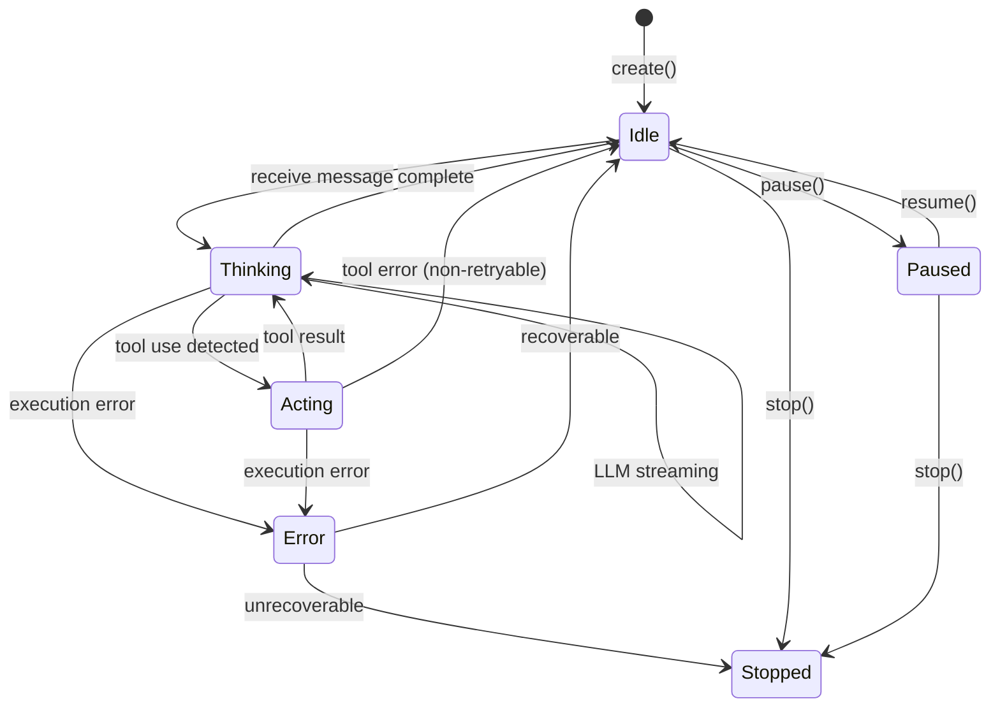

# Agent Runtime (Agent 运行时)

## 概述

### 职责描述

Agent Runtime 负责单个 Agent 的执行逻辑，包括：

- Agent 生命周期管理（初始化、执行、停止）
- LLM 调用和响应处理
- Tool/Skill 调用执行
- 上下文管理和状态更新
- 错误处理和重试逻辑

### 设计目标

1. **隔离性**: 每个 Agent 实例独立运行，状态不共享
2. **可靠性**: 自动重试和错误恢复
3. **可观测性**: 完整的执行追踪和日志
4. **可扩展性**: 支持自定义 Agent 变体

### 依赖模块

| 依赖模块 | 依赖类型 | 说明 |
|---------|---------|------|
| Session Manager | 依赖 | 获取会话上下文 |
| LLM Provider | 依赖 | LLM 调用 |
| Tool System | 依赖 | 工具执行 |
| Skill Engine | 依赖 | 技能触发 |
| Hook Engine | 依赖 | 生命周期钩子 |

---

## 接口定义

### 对外接口

```yaml
# Agent Runtime 接口定义
AgentRuntime:
  # ========== Agent 生命周期 ==========
  create_agent:
    description: 创建 Agent 实例
    inputs:
      definition:
        type: AgentDefinition
        description: Agent 定义
        required: true
      session_id:
        type: string
        description: 所属会话 ID
        required: true
      variant:
        type: string
        description: Agent 变体名称
        required: false
    outputs:
      agent_id:
        type: string
      agent:
        type: Agent

  start_agent:
    description: 启动 Agent
    inputs:
      agent_id:
        type: string
        required: true
    outputs:
      success:
        type: boolean

  stop_agent:
    description: 停止 Agent
    inputs:
      agent_id:
        type: string
        required: true
      force:
        type: boolean
        description: 强制停止
        required: false
        default: false
    outputs:
      success:
        type: boolean

  get_agent_state:
    description: 获取 Agent 状态
    inputs:
      agent_id:
        type: string
        required: true
    outputs:
      state:
        type: AgentState

  # ========== 消息处理 ==========
  send_message:
    description: 发送消息给 Agent
    inputs:
      agent_id:
        type: string
        required: true
      message:
        type: Message
        required: true
    outputs:
      response:
        type: async_stream<MessageChunk>
        description: 流式响应

  # ========== 上下文管理 ==========
  get_context:
    description: 获取 Agent 上下文
    inputs:
      agent_id:
        type: string
        required: true
    outputs:
      context:
        type: AgentContext

  update_variables:
    description: 更新 Agent 变量
    inputs:
      agent_id:
        type: string
        required: true
      variables:
        type: map<string, any>
        required: true
    outputs:
      success:
        type: boolean

  # ========== 执行控制 ==========
  pause:
    description: 暂停 Agent 执行
    inputs:
      agent_id:
        type: string
        required: true
    outputs:
      success:
        type: boolean

  resume:
    description: 恢复 Agent 执行
    inputs:
      agent_id:
        type: string
        required: true
    outputs:
      success:
        type: boolean

  # ========== 工具调用代理 ==========
  call_tool:
    description: Agent 调用工具（内部接口）
    inputs:
      agent_id:
        type: string
        required: true
      tool_name:
        type: string
        required: true
      args:
        type: object
        required: true
    outputs:
      result:
        type: ToolResult
```

### 数据结构

```yaml
# Agent 定义
AgentDefinition:
  id:
    type: string
    description: Agent 唯一标识
  name:
    type: string
    description: Agent 名称
  role:
    type: string
    description: Agent 角色描述
  model:
    type: ModelConfig
    description: 模型配置
  instructions:
    type: string
    description: 系统指令
  tools:
    type: array<string>
    description: 可用工具列表
  skills:
    type: array<string>
    description: 可用技能列表
  permissions:
    type: PermissionConfig
    description: 权限配置
  variants:
    type: array<AgentVariant>
    description: 支持的变体

# Model 配置
ModelConfig:
  provider:
    type: string
    description: 提供者 (anthropic/openai/custom)
  model:
    type: string
    description: 模型名称
  temperature:
    type: float
    description: 温度参数
    default: 0.7
  max_tokens:
    type: integer
    description: 最大输出 Token
    default: 4096

# Agent 变体
AgentVariant:
  name:
    type: string
    description: 变体名称
  model:
    type: ModelConfig
    description: 覆盖的模型配置
  instructions:
    type: string
    description: 覆盖的系统指令

# Agent 实例
Agent:
  id:
    type: string
    description: 实例 ID
  definition:
    type: AgentDefinition
    description: 使用的定义
  session_id:
    type: string
    description: 所属会话
  variant:
    type: string | null
    description: 当前变体
  state:
    type: AgentState
    description: 运行状态
  context:
    type: AgentContext
    description: 运行上下文

# Agent 状态
AgentState:
  status:
    type: enum
    values: [idle, thinking, acting, paused, error, stopped]
    description: 状态标识
  current_action:
    type: string | null
    description: 当前执行的动作
  error:
    type: ErrorInfo | null
    description: 错误信息
  statistics:
    type: AgentStatistics
    description: 统计信息

# Agent 上下文
AgentContext:
  messages:
    type: array<Message>
    description: 消息历史
  variables:
    type: map<string, any>
    description: 变量
  memory:
    type: array<MemoryItem>
    description: 记忆项

# 记忆项
MemoryItem:
  key:
    type: string
  value:
    type: any
  timestamp:
    type: datetime

# Agent 统计
AgentStatistics:
  messages_sent:
    type: integer
  messages_received:
    type: integer
  tools_called:
    type: integer
  llm_calls:
    type: integer
  total_tokens:
    type: integer
  errors:
    type: integer

# 错误信息
ErrorInfo:
  code:
    type: string
  message:
    type: string
  details:
    type: object
  retryable:
    type: boolean
    description: 是否可重试

# Message 数据结构
Message:
  role:
    type: enum
    values: [user, assistant, system]
  content:
    type: string | array<ContentBlock>
  timestamp:
    type: datetime
  metadata:
    type: map<string, any>

# ContentBlock
ContentBlock:
  type:
    type: enum
    values: [text, image, tool_use, tool_result]
  content:
    type: any

# Tool 调用结果
ToolResult:
  success:
    type: boolean
  data:
    type: any
  error:
    type: string | null
  duration_ms:
    type: integer
```

### 配置选项

```yaml
# config/agent.yaml
agent:
  # 执行配置
  execution:
    max_execution_time: 300      # 最大执行时间（秒）
    max_tool_calls: 50           # 最大工具调用次数
    max_llm_calls: 20            # 最大 LLM 调用次数

  # 重试配置
  retry:
    max_attempts: 3              # 最大重试次数
    delay: 1000                  # 重试延迟（毫秒）
    backoff: exponential         # 退避策略
    retryable_errors:
      - rate_limit
      - timeout
      - connection_error

  # 超时配置
  timeout:
    llm_call: 60                 # LLM 调用超时（秒）
    tool_call: 30                # 工具调用超时（秒）

  # 流式输出
  streaming:
    enabled: true
    chunk_size: 100              # 流式块大小
```

---

## 核心流程

### Agent 执行流程

```
接收用户消息
        │
        ▼
┌──────────────────────────────┐
│ 1. 触发 before hooks         │
│    - agent_execute hook      │
└──────────────────────────────┘
        │
        ▼
┌──────────────────────────────┐
│ 2. 构建对话上下文            │
│    - 获取历史消息            │
│    - 添加系统指令            │
│    - 插入工具定义            │
└──────────────────────────────┘
        │
        ▼
┌──────────────────────────────┐
│ 3. 调用 LLM                  │
│    - 发送请求                │
│    - 流式接收响应            │
└──────────────────────────────┘
        │
        ▼
    ┌───┴────┐
    │ 有工具  │
    │ 调用？  │
    └───┬────┘
        │ 是                │ 否
        ▼                   ▼
┌──────────────────┐   ┌──────────────┐
│ 4. 执行工具调用  │   │ 6. 返回响应  │
│    - 解析工具名  │   └──────────────┘
│    - 调用工具    │          │
│    - 获取结果    │          ▼
└──────────────────┘   ┌──────────────┐
        │              │ 7. 触发      │
        ▼              │ after hooks  │
┌──────────────────┐   └──────────────┘
│ 5. 将结果加入    │          │
│    上下文        │          ▼
│    → 回到步骤3   │    完成
└──────────────────┘
```

### Tool 调用流程

```
Agent 请求调用工具
        │
        ▼
┌──────────────────────────────┐
│ 1. 触发 tool_call hook       │
│    - before hook             │
└──────────────────────────────┘
        │
        ▼
┌──────────────────────────────┐
│ 2. 权限检查                  │
│    - 检查工具是否允许        │
│    - 检查参数是否有效        │
└──────────────────────────────┘
        │
        ▼
    ┌───┴────┐
    │ 通过？  │
    └───┬────┘
        │ 否
        ▼
    返回权限错误
        │ 是
        ▼
┌──────────────────────────────┐
│ 3. 执行工具                  │
│    - 调用 Tool System        │
│    - 传入参数                │
└──────────────────────────────┘
        │
        ▼
    ┌───┴────┐
    │ 成功？  │
    └───┬────┘
        │ 否                │ 是
        ▼                   ▼
┌──────────────────┐   ┌──────────────┐
│ 4. 错误处理      │   │ 5. 记录结果  │
│    - 检查可重试  │   │    更新统计  │
│    - 记录错误    │   └──────────────┘
└──────────────────┘          │
        │                     ▼
        ▼              ┌──────────────┐
┌──────────────────┐   │ 6. 触发      │
│ 5. 触发          │   │ tool_result  │
│ tool_result hook │   │ hook         │
└──────────────────┘   └──────────────┘
        │                     │
        ▼                     ▼
    返回错误          返回结果
```

### 状态机设计



### 错误处理与重试

```
执行过程中发生错误
        │
        ▼
┌──────────────────────────────┐
│ 1. 分类错误类型              │
│    - 可重试错误              │
│    - 不可重试错误            │
└──────────────────────────────┘
        │
        ▼
    ┌───┴────┐
    │ 可重试？│
    └───┬────┘
        │ 否                │ 是
        ▼                   ▼
┌──────────────────┐   ┌──────────────┐
│ 2. 记录错误      │   │ 检查重试次数 │
│    更新状态      │   └──────────────┘
└──────────────────┘          │
        │               ┌────┴────┐
        ▼               │ 超限？  │
┌──────────────────┐   └────┬────┘
│ 3. 触发          │        │ 否      │ 是
│ error hook       │        ▼         ▼
└──────────────────┘   ┌──────────┐ ┌──────────────┐
        │              │ 等待延迟  │ │ 2. 记录错误  │
        ▼              │ 重新执行  │ │    放弃重试  │
┌──────────────────┐   └──────────┘ └──────────────┘
│ 4. 返回错误响应  │        │             │
└──────────────────┘        └──────┬──────┘
                                   ▼
                           ┌──────────────┐
                           │ 3. 返回错误  │
                           └──────────────┘
```

---

## 模块交互

### 依赖关系图

```
┌─────────────────────────────────────────┐
│           Agent Runtime                 │
├─────────────────────────────────────────┤
│                                         │
│  ┌──────────┐  ┌──────────┐  ┌────────┐│
│  │Executor  │  │State Mgr │  │Monitor ││
│  └──────────┘  └──────────┘  └────────┘│
└─────┬──────────────┬──────────────┬─────┘
      │              │              │
      ▼              ▼              ▼
┌──────────┐  ┌──────────┐  ┌──────────┐
│LLM       │  │Tool      │  │Skill     │
│Provider  │  │System    │  │Engine    │
└──────────┘  └──────────┘  └──────────┘
      │              │              │
      ▼              ▼              ▼
┌──────────┐  ┌──────────┐  ┌──────────┐
│Hook      │  │Session   │  │Context   │
│Engine    │  │Manager   │  │Compressor│
└──────────┘  └──────────┘  └──────────┘
```

### 消息流

```
用户请求
    │
    ▼
┌─────────────────────────────┐
│ CLI / Web UI                │
└─────────────────────────────┘
        │
        ▼
┌─────────────────────────────┐
│ Session Manager             │
│ - 获取/创建会话             │
│ - 检查权限                  │
└─────────────────────────────┘
        │
        ▼
┌─────────────────────────────┐
│ Agent Runtime               │
│ - 创建/获取 Agent           │
│ - 发送消息                  │
└─────────────────────────────┘
        │
        ├─────────────────────────────┐
        │                             │
        ▼                             ▼
┌─────────────────┐         ┌─────────────────┐
│ LLM Provider    │         │ Tool System     │
│ - 调用模型      │         │ - 执行工具      │
└─────────────────┘         └─────────────────┘
        │                             │
        └────────────┬────────────────┘
                     ▼
        ┌─────────────────────────────┐
        │ Agent Runtime               │
        │ - 处理响应                  │
        │ - 更新状态                  │
        └─────────────────────────────┘
                     │
                     ▼
              返回给用户
```

---

## 配置与部署

### 配置文件格式

```yaml
# config/agent.yaml
agent:
  # 执行限制
  execution:
    max_execution_time: 300
    max_tool_calls: 50
    max_llm_calls: 20

  # 重试策略
  retry:
    max_attempts: 3
    delay: 1000
    backoff: exponential
    retryable_errors:
      - rate_limit
      - timeout
      - connection_error

  # 超时配置
  timeout:
    llm_call: 60
    tool_call: 30

  # 流式输出
  streaming:
    enabled: true
    chunk_size: 100

  # 默认模型配置
  default_model:
    provider: anthropic
    model: claude-sonnet-4-6
    temperature: 0.7
    max_tokens: 8192
```

### 环境变量

```bash
# Agent 配置
export KNIGHT_MAX_EXECUTION_TIME=300
export KNIGHT_MAX_TOOL_CALLS=50
export KNIGHT_MAX_LLM_CALLS=20

# 重试配置
export KNIGHT_RETRY_MAX_ATTEMPTS=3
export KNIGHT_RETRY_DELAY=1000

# 超时配置
export KNIGHT_TIMEOUT_LLM_CALL=60
export KNIGHT_TIMEOUT_TOOL_CALL=30
```

### 部署考虑

1. **资源限制**: 根据服务器资源调整执行时间和调用次数限制
2. **并发控制**: 同一会话内可能存在多个 Agent，需注意资源竞争
3. **监控**: 建议记录所有 Agent 执行日志用于调试

---

## 示例

### 使用场景

#### 场景 1: 创建并发送消息给 Agent

```bash
# CLI 命令
knight chat code-reviewer

# 内部调用
agent = agent_runtime.create_agent(
    definition=agent_definition,
    session_id="abc123"
)

response = agent_runtime.send_message(
    agent_id=agent.id,
    message={
        "role": "user",
        "content": "请审查 src/main.ts 文件"
    }
)
```

#### 场景 2: 使用 Agent 变体

```bash
# CLI 命令
knight chat code-reviewer:quick

# 内部调用
agent = agent_runtime.create_agent(
    definition=agent_definition,
    session_id="abc123",
    variant="quick"
)
```

#### 场景 3: 流式响应处理

```python
# 伪代码
async for chunk in agent_runtime.send_message(
    agent_id=agent.id,
    message=user_message
):
    print(chunk.content, end="", flush=True)
```

### 配置示例

#### 开发环境

```yaml
agent:
  execution:
    max_execution_time: 600  # 较长超时便于调试
  retry:
    max_attempts: 5
  timeout:
    llm_call: 120
```

#### 生产环境

```yaml
agent:
  execution:
    max_execution_time: 300
  retry:
    max_attempts: 3
  timeout:
    llm_call: 60
```

---

## 附录

### 性能指标

| 指标 | 目标值 | 说明 |
|------|--------|------|
| Agent 创建延迟 | < 50ms | 内存操作 |
| 消息处理首字延迟 | < 2s | TTFB |
| 工具调用延迟 | < 100ms | 不含工具执行时间 |
| 内存占用 | < 100MB | 单 Agent 实例 |

### 错误处理

```yaml
error_codes:
  AGENT_NOT_FOUND:
    code: 404
    message: "Agent 不存在"
    action: "检查 Agent ID"

  AGENT_ALREADY_RUNNING:
    code: 409
    message: "Agent 已在运行"
    action: "使用现有 Agent 或先停止"

  EXECUTION_TIMEOUT:
    code: 408
    message: "执行超时"
    action: "增加超时时间或优化任务"

  TOOL_EXECUTION_FAILED:
    code: 500
    message: "工具执行失败"
    action: "查看工具错误详情"

  LLM_CALL_FAILED:
    code: 502
    message: "LLM 调用失败"
    action: "检查 LLM 服务状态"

  RATE_LIMIT_EXCEEDED:
    code: 429
    message: "超过速率限制"
    action: "等待后重试"
    retryable: true
```

### 测试策略

```yaml
test_plan:
  unit_tests:
    - Agent 创建/销毁
    - 状态转换
    - 消息处理
    - 工具调用

  integration_tests:
    - 端到端对话
    - 多轮工具调用
    - 错误恢复
    - 流式输出

  performance_tests:
    - 并发 Agent
    - 长时间运行
    - 内存泄漏检测

  edge_cases:
    - 空消息处理
    - 超大响应处理
    - 工具失败处理
    - LLM 超时处理
```
