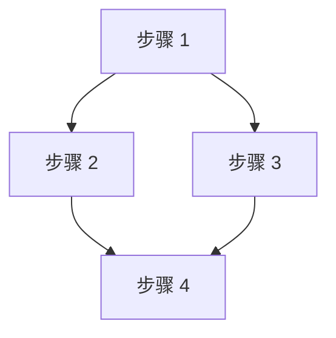
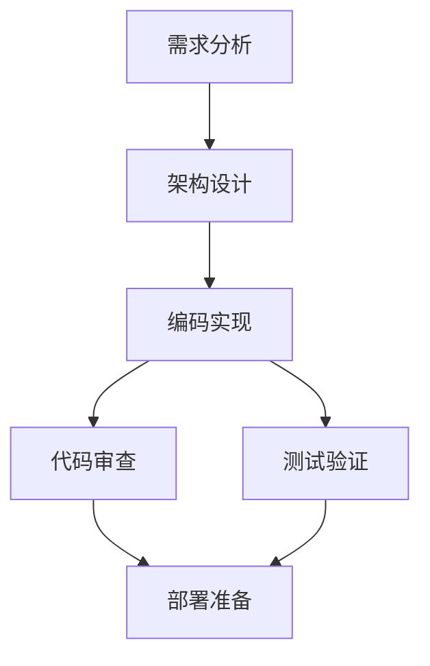

# Workflows Directory (工作流目录)

## 概述

### 职责描述

Workflows Directory 是存储和管理自然语言工作流定义的目录结构，包括：

- 工作流定义文件的存储和索引
- 工作流元数据管理
- 工作流版本控制
- 工作流分类和标签

### 设计目标

1. **自然语言优先**: 工作流使用自然语言描述，便于理解
2. **易于维护**: Markdown 格式，支持版本控制
3. **可发现**: 支持分类、标签和搜索
4. **可扩展**: 支持自定义工作流

### 目录结构

```
workflows/
├── README.md                           # 工作流目录索引
├── software-development/              # 软件开发工作流
│   ├── README.md
│   ├── feature-development.md
│   ├── bug-fix.md
│   └── refactoring.md
├── code-quality/                      # 代码质量工作流
│   ├── README.md
│   ├── code-review.md
│   ├── security-audit.md
│   └── performance-review.md
├── deployment/                        # 部署工作流
│   ├── README.md
│   ├── staging-deploy.md
│   └── production-deploy.md
├── documentation/                     # 文档工作流
│   ├── README.md
│   ├── api-docs.md
│   └── user-guide.md
└── maintenance/                       # 维护工作流
    ├── README.md
    ├── database-migration.md
    └── backup-verify.md
```

---

## 工作流定义格式

### 标准格式

每个工作流定义是一个 Markdown 文件，包含以下部分：

```markdown
---
name: [工作流标识符]
category: [分类]
tags: [标签列表]
description: [简短描述]
author: [作者]
version: [版本]
---

# [工作流名称]

## 概述

[详细描述工作流的目的和适用场景]

## 前置条件

- [条件 1]
- [条件 2]

## 输入参数

| 参数 | 类型 | 必需 | 描述 |
|------|------|------|------|
| param1 | string | 是 | 参数说明 |
| param2 | file | 否 | 文件路径 |

## 执行步骤

### 步骤 1: [步骤名称]

使用 **Agent [variant]** 执行：

```
[自然语言描述任务内容]
```

输入：
- `input1`: 来自 {{ context.param1 }}
- `input2`: 来自 {{ steps.step0.output }}

输出：
- `output1`: 结果描述

### 步骤 2: [步骤名称]

在 **步骤 1 完成后**执行：

使用 **Agent [variant]** 执行：

```
[自然语言描述任务内容]
```

## 依赖关系



## 输出结果

- [主要输出 1]
- [输出 2]

## 注意事项

- [注意事项 1]
- [注意事项 2]
```

### 完整示例：Feature Development 工作流

```markdown
---
name: feature-development
category: software-development
tags: [development, feature, agile]
description: 完整的功能开发工作流，从需求到部署
author: Knight Team
version: 1.0.0
---

# Feature Development Workflow

## 概述

此工作流用于开发新功能，包括需求分析、架构设计、编码实现、代码审查、测试验证和部署准备的全流程。

适用场景：
- 新功能开发
- 重大功能改进
- 需要多角色协作的开发任务

## 前置条件

- 已有明确的需求文档或需求描述
- 代码仓库已初始化
- 开发环境已配置

## 输入参数

| 参数 | 类型 | 必需 | 描述 |
|------|------|------|------|
| requirement | file/string | 是 | 需求文档路径或需求描述 |
| target_branch | string | 否 | 目标分支，默认为 `main` |
| reviewers | number | 否 | 代码审查人数，默认为 2 |

## 执行步骤

### 步骤 1: 需求分析

使用 **Agent architect** 执行：

```
分析以下需求，生成详细的需求分析文档：

{{ requirement }}

请包含：
1. 功能边界
2. 技术可行性分析
3. 潜在风险
4. 依赖项识别
```

输入：
- `requirement`: 来自输入参数

输出：
- `analysis_doc`: 需求分析文档（Markdown 格式）

---

### 步骤 2: 架构设计

在 **步骤 1 完成后**执行：

使用 **Agent architect** 执行：

```
基于需求分析结果，设计技术架构：

{{ steps.step1.output.analysis_doc }}

请提供：
1. 系统架构图
2. 模块划分
3. 接口设计
4. 数据模型
5. 技术选型建议
```

输入：
- `analysis_doc`: 来自 {{ steps.step1.output.analysis_doc }}

输出：
- `design_doc`: 架构设计文档

---

### 步骤 3: 编码实现

在 **步骤 2 完成后**执行：

使用 **Agent developer** 执行：

```
根据架构设计，实现功能代码：

{{ steps.step2.output.design_doc }}

要求：
1. 遵循项目代码规范
2. 添加必要的注释
3. 编写单元测试
4. 更新相关文档
```

输入：
- `design_doc`: 来自 {{ steps.step2.output.design_doc }}
- `target_branch`: 来自输入参数

输出：
- `implementation`: 实现摘要（修改的文件列表）
- `code_diff`: 代码差异

---

### 步骤 4: 代码审查

在 **步骤 3 完成后**执行：

使用 **Agent reviewer** 执行：

```
审查以下代码实现：

{{ steps.step3.output.code_diff }}

审查要点：
1. 代码质量
2. 安全性
3. 性能考虑
4. 可维护性
5. 测试覆盖
```

输入：
- `code_diff`: 来自 {{ steps.step3.output.code_diff }}

输出：
- `review_report`: 代码审查报告
- `approved`: 是否批准（boolean）

---

### 步骤 5: 测试验证

在 **步骤 3 完成后**（可与步骤 4 并行）执行：

使用 **Agent tester** 执行：

```

为以下实现设计并执行测试：

{{ steps.step3.output.implementation }}

测试类型：
1. 单元测试
2. 集成测试
3. 边界条件测试
```

输入：
- `implementation`: 来自 {{ steps.step3.output.implementation }}

输出：
- `test_report`: 测试报告
- `passed`: 是否通过（boolean）

---

### 步骤 6: 部署准备

在 **步骤 4 和步骤 5 都完成后**执行：

使用 **Agent devops** 执行：

```

准备部署以下功能：

- 需求分析：{{ steps.step1.output.analysis_doc }}
- 架构设计：{{ steps.step2.output.design_doc }}
- 代码实现：{{ steps.step3.output.implementation }}
- 审查状态：{{ steps.step4.output.approved }}
- 测试状态：{{ steps.step5.output.passed }}

任务：
1. 生成部署清单
2. 准备回滚方案
3. 生成发布说明
```

输入：
- 汇总所有前置步骤的输出

输出：
- `deployment_plan`: 部署计划
- `release_notes`: 发布说明

## 依赖关系



## 输出结果

1. 需求分析文档
2. 架构设计文档
3. 实现代码
4. 代码审查报告
5. 测试报告
6. 部署计划
7. 发布说明

## 执行模式

- **推荐模式**: 后台执行（可能需要数小时到数天）
- **最小执行时间**: ~30 分钟（简单功能）
- **典型执行时间**: ~4-8 小时（中等复杂度功能）
- **最长执行时间**: 数天（复杂功能，包含多轮审查）

## 注意事项

1. 代码审查未通过时，工作流会返回到步骤 3
2. 测试失败时，工作流会暂停等待人工干预
3. 所有中间结果都会持久化，支持断点恢复
4. 可以通过 CLI 查询工作流进度：`/workflow status <workflow_id>`
```

---

## 索引文件

### 主索引 (workflows/README.md)

```markdown
# Knight Agent Workflows

本目录包含所有可用的自然语言工作流定义。

## 分类索引

### 软件开发 (software-development/)
- [Feature Development](software-development/feature-development.md) - 完整的功能开发流程
- [Bug Fix](software-development/bug-fix.md) - Bug 修复工作流
- [Refactoring](software-development/refactoring.md) - 代码重构工作流

### 代码质量 (code-quality/)
- [Code Review](code-quality/code-review.md) - 代码审查工作流
- [Security Audit](code-quality/security-audit.md) - 安全审计工作流
- [Performance Review](code-quality/performance-review.md) - 性能优化工作流

### 部署 (deployment/)
- [Staging Deploy](deployment/staging-deploy.md) - 预发布部署流程
- [Production Deploy](deployment/production-deploy.md) - 生产部署流程

### 文档 (documentation/)
- [API Docs](documentation/api-docs.md) - API 文档生成
- [User Guide](documentation/user-guide.md) - 用户指南编写

## 使用方法

### 列出所有工作流

```bash
/workflow list
```

### 查看工作流详情

```bash
/workflow info feature-development
```

### 执行工作流

```bash
/workflow feature-development docs/requirements.md
```

### 查询工作流状态

```bash
/workflow status <workflow_id>
```

## 创建自定义工作流

在相应分类目录下创建新的 Markdown 文件，遵循[标准格式]定义。

---

最后更新：2026-04-02
```

---

## 命令集成

### 与 Command 模块的交互

```
用户输入: /workflow feature-development docs/requirements.md
        │
        ▼
┌──────────────────────────────┐
│ Command 模块                 │
│ 1. 识别 workflow 命令类型   │
│ 2. 解析工作流名称和参数     │
└──────────────────────────────┘
        │
        ▼
┌──────────────────────────────┐
│ 加载工作流定义               │
│ 路径: workflows/             │
│       software-development/  │
│       feature-development.md │
└──────────────────────────────┘
        │
        ▼
┌──────────────────────────────┐
│ LLM 解析                     │
│ - 提取任务列表               │
│ - 解析依赖关系               │
│ - 生成 ParsedWorkflow        │
└──────────────────────────────┘
        │
        ▼
┌──────────────────────────────┐
│ Task Manager                 │
│ create_workflow_from_parsed()│
└──────────────────────────────┘
```

### 工作流命令格式

```bash
# 列出所有工作流
/workflow list

# 查看工作流信息
/workflow info <workflow-name>

# 执行工作流（前台）
/workflow exec <workflow-name> <args>...
/workflow exec --foreground <workflow-name> <args>...

# 执行工作流（后台，默认）
/workflow <workflow-name> <args>...

# 查询工作流状态
/workflow status <workflow-id>

# 暂停工作流
/workflow pause <workflow-id>

# 恢复工作流
/workflow resume <workflow-id>

# 终止工作流
/workflow terminate <workflow-id>
```

---

## 配置与部署

### 配置文件

```yaml
# config/workflow.yaml
workflow:
  # 工作流目录
  directories:
    - "./workflows"
    - "~/.knight-agent/workflows"

  # 执行配置
  execution:
    default_mode: background
    timeout: 604800  # 7 天

  # 版本控制
  versioning:
    enabled: true
    git_tracking: true

  # 缓存
  cache:
    enabled: true
    ttl: 3600
```

### 环境变量

```bash
export KNIGHT_WORKFLOW_DIRS="./workflows:~/.knight-agent/workflows"
export KNIGHT_WORKFLOW_DEFAULT_MODE="background"
```

---

## 附录

### 内置工作流列表

| 工作流 | 分类 | 描述 | 预计时间 |
|--------|------|------|----------|
| feature-development | software-development | 功能开发全流程 | 4-8 小时 |
| bug-fix | software-development | Bug 修复 | 1-2 小时 |
| code-review | code-quality | 代码审查 | 30 分钟 |
| security-audit | code-quality | 安全审计 | 2-4 小时 |
| staging-deploy | deployment | 预发布部署 | 30 分钟 |
| production-deploy | deployment | 生产部署 | 1 小时 |

### 工作流模板

创建新工作流时，可以使用以下模板：

```markdown
---
name: [工作流标识符]
category: [分类]
tags: [标签列表]
description: [简短描述]
version: 1.0.0
---

# [工作流名称]

## 概述

[工作流描述]

## 前置条件

- [条件 1]
- [条件 2]

## 输入参数

| 参数 | 类型 | 必需 | 描述 |
|------|------|------|------|
| ... | ... | ... | ... |

## 执行步骤

### 步骤 1: [步骤名称]

使用 **Agent [variant]** 执行：

```
[自然语言描述]
```

...

## 输出结果

- [输出 1]
- [输出 2]

## 注意事项

- [注意事项 1]
```

### 错误处理

```yaml
error_codes:
  WORKFLOW_NOT_FOUND:
    code: 404
    message: "工作流不存在"
    action: "使用 /workflow list 查看可用工作流"

  WORKFLOW_PARSE_FAILED:
    code: 400
    message: "工作流定义解析失败"
    action: "检查工作流定义格式"

  WORKFLOW_TIMEOUT:
    code: 408
    message: "工作流执行超时"
    action: "检查工作流状态或增加超时时间"

  WORKFLOW_CANCELLED:
    code: 499
    message: "工作流已取消"
    action: "查看取消原因"
```
