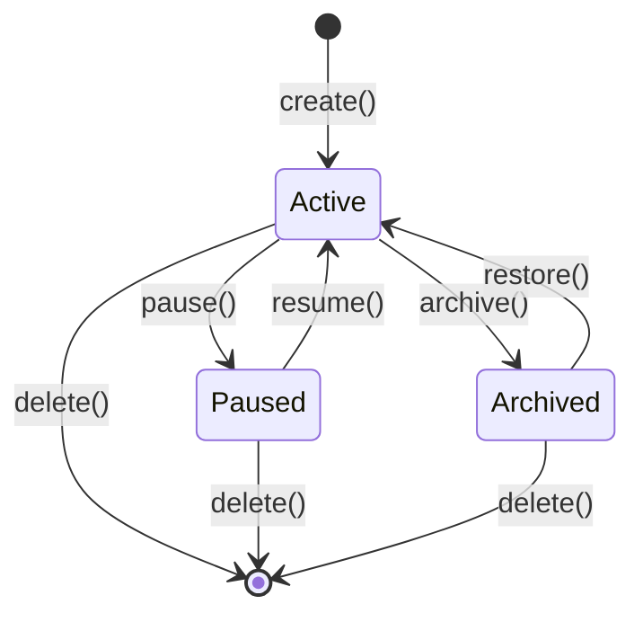

# Session Manager (会话管理器)

## 1. 概述

### 1.1 职责描述

Session Manager 负责管理 Knight-Agent 的所有会话生命周期，包括：

- 会话的创建、切换、删除和持久化
- Workspace 隔离和路径权限控制
- 上下文管理和自动压缩
- 消息历史存储和检索
- 多会话并行执行
- 项目类型检测和文件索引
- Git 信息集成

### 1.2 设计目标

1. **隔离性**: 每个会话拥有独立的 Workspace 和上下文，互不干扰
2. **并行性**: 支持多个会话同时运行
3. **持久化**: 会话状态可保存和恢复
4. **自动管理**: 自动压缩长对话，节省 Token
5. **智能检测**: 自动检测项目类型和文件变化

### 1.3 核心需求

| 需求 | 描述 | 优先级 |
|------|------|--------|
| **多会话并行** | 同时运行多个独立会话，互不干扰 | P0 |
| **Workspace 隔离** | 不同项目的工作区完全隔离 | P0 |
| **会话历史** | 保存会话记录，支持恢复和查询 | P1 |
| **上下文压缩** | 智能压缩长上下文，保留关键信息 | P1 |
| **会话共享** | 多 Agent 共享同一会话上下文 | P1 |

### 1.4 依赖模块

| 依赖模块 | 依赖类型 | 说明 |
|---------|---------|------|
| Storage Service | 依赖 | 会话数据持久化 |
| Context Compressor | 依赖 | 上下文压缩 |
| Security Manager | 依赖 | 路径权限检查 |

---

## 2. 接口定义

### 2.1 对外接口

```yaml
# Session Manager 接口定义
SessionManager:
  # ========== 会话管理 ==========
  create_session:
    description: 创建新会话
    inputs:
      name:
        type: string
        description: 会话名称
        required: false
        default: "session-{timestamp}"
      workspace:
        type: string
        description: 工作目录路径
        required: true
      project_type:
        type: string
        description: 项目类型 (rust/node/python/auto)
        required: false
        default: "auto"
    outputs:
      session_id:
        type: string
        description: 会话唯一标识
      session:
        type: Session
        description: 会话对象

  get_session:
    description: 获取会话信息
    inputs:
      id:
        type: string
        description: 会话 ID
        required: true
    outputs:
      session:
        type: Session | null
        description: 会话对象，不存在返回 null

  list_sessions:
    description: 列出所有会话
    inputs:
      status:
        type: string
        description: 过滤状态 (active/paused/archived/all)
        required: false
        default: "all"
    outputs:
      sessions:
        type: array<Session>
        description: 会话列表

  delete_session:
    description: 删除会话
    inputs:
      id:
        type: string
        description: 会话 ID
        required: true
      force:
        type: boolean
        description: 强制删除（忽略未保存更改）
        required: false
        default: false
    outputs:
      success:
        type: boolean

  archive_session:
    description: 归档会话
    inputs:
      id:
        type: string
        description: 会话 ID
        required: true
    outputs:
      success:
        type: boolean

  restore_session:
    description: 恢复已归档的会话
    inputs:
      id:
        type: string
        description: 会话 ID
        required: true
    outputs:
      session:
        type: Session

  # ========== 会话切换 ==========
  use_session:
    description: 切换到指定会话
    inputs:
      id:
        type: string
        description: 会话 ID
        required: true
    outputs:
      session:
        type: Session
        description: 当前活动会话

  get_current_session:
    description: 获取当前活动会话
    outputs:
      session:
        type: Session | null

  # ========== 上下文管理 ==========
  add_message:
    description: 添加消息到会话上下文
    inputs:
      session_id:
        type: string
        required: true
      message:
        type: Message
        required: true
    outputs:
      should_compress:
        type: boolean
        description: 是否需要触发上下文压缩

  get_context:
    description: 获取会话上下文
    inputs:
      session_id:
        type: string
        required: true
      include_compressed:
        type: boolean
        description: 是否包含压缩点摘要
        required: false
        default: true
    outputs:
      messages:
        type: array<Message>
      compression_points:
        type: array<CompressionPoint>
      variables:
        type: map<string, any>

  compress_context:
    description: 压缩会话上下文
    inputs:
      session_id:
        type: string
        required: true
      method:
        type: string
        description: 压缩方法 (summary/semantic/hybrid)
        required: false
        default: "summary"
    outputs:
      compression_point:
        type: CompressionPoint

  # ========== 历史搜索 ==========
  search_history:
    description: 搜索会话历史
    inputs:
      query:
        type: string
        description: 搜索关键词
        required: true
      session_id:
        type: string
        description: 限定会话 ID，为空则搜索所有会话
        required: false
      limit:
        type: integer
        description: 返回结果数量限制
        required: false
        default: 10
    outputs:
      results:
        type: array<SearchResult>
        description: 搜索结果

  # ========== 持久化 ==========
  save_session:
    description: 保存会话到磁盘
    inputs:
      id:
        type: string
        description: 会话 ID，为空则保存当前会话
        required: false
    outputs:
      path:
        type: string
        description: 保存路径

  load_session:
    description: 从磁盘加载会话
    inputs:
      id:
        type: string
        description: 会话 ID
        required: true
    outputs:
      session:
        type: Session

  # ========== Workspace 管理 ==========
  check_path_access:
    description: 检查路径访问权限
    inputs:
      session_id:
        type: string
        required: true
      path:
        type: string
        description: 要访问的路径
        required: true
      action:
        type: string
        description: 操作类型 (read/write/execute)
        required: true
    outputs:
      allowed:
        type: boolean
      reason:
        type: string
        description: 拒绝原因（如果拒绝）

  validate_path:
    description: 验证路径是否在 Workspace 范围内
    inputs:
      session_id:
        type: string
        required: true
      path:
        type: string
        description: 要验证的路径
        required: true
    outputs:
      valid:
        type: boolean

  rebuild_file_index:
    description: 重建文件索引
    inputs:
      session_id:
        type: string
        required: true
    outputs:
      file_count:
        type: integer
        description: 索引的文件数量
```

### 2.2 数据结构

#### 2.2.1 YAML 数据结构

```yaml
# Session 数据结构
Session:
  id:
    type: string
    description: 唯一标识符 (UUID)
  name:
    type: string
    description: 会话名称
  status:
    type: enum
    values: [active, paused, archived]
    description: 会话状态
  workspace:
    type: Workspace
    description: 工作空间信息
  context:
    type: Context
    description: 会话上下文
  created_at:
    type: datetime
    description: 创建时间
  last_active_at:
    type: datetime
    description: 最后活跃时间

# Workspace 数据结构
Workspace:
  root:
    type: string
    description: 项目根目录（绝对路径）
  allowed_paths:
    type: array<string>
    description: 允许访问的路径列表
  project_type:
    type: string
    description: 项目类型
  git_info:
    type: GitInfo | null
    description: Git 仓库信息

# GitInfo 数据结构
GitInfo:
  branch:
    type: string
  commit:
    type: string
  remote:
    type: string | null
  is_dirty:
    type: boolean

# Context 数据结构
Context:
  messages:
    type: array<Message>
    description: 消息历史
  compression_points:
    type: array<CompressionPoint>
    description: 压缩点
  variables:
    type: map<string, any>
    description: 会话变量
  agent_state:
    type: map<string, any>
    description: Agent 状态

# Message 数据结构
Message:
  id:
    type: string
  role:
    type: enum
    values: [user, assistant, system, tool]
  content:
    type: string | array<ContentBlock>
  timestamp:
    type: datetime
  metadata:
    type: map<string, any>
    description: 附加元数据

# ContentBlock 数据结构（多模态支持）
ContentBlock:
  type:
    type: enum
    values: [text, image, file_ref, tool_use]
  content:
    type: string | object

# CompressionPoint 数据结构
CompressionPoint:
  id:
    type: string
  before_count:
    type: integer
    description: 压缩前的消息数
  after_count:
    type: integer
    description: 压缩后的消息数
  summary:
    type: string
    description: 压缩摘要
  timestamp:
    type: datetime
  token_saved:
    type: integer
    description: 保存的 Token 数量

# SearchResult 数据结构
SearchResult:
  session_id:
    type: string
  session_name:
    type: string
  message_id:
    type: string
  content:
    type: string
  timestamp:
    type: datetime
  score:
    type: float
    description: 相关性分数
```

#### 2.2.2 Rust 数据模型实现

```rust
// 会话 ID: 全局唯一标识
pub type SessionId = String;

// 会话状态
pub enum SessionStatus {
    Active,      // 活跃中
    Paused,      // 暂停
    Archived,    // 已归档
}

// 会话配置
pub struct SessionConfig {
    pub name: Option<String>,
    pub workspace: PathBuf,
    pub context_limit: usize,        // 上下文消息限制
    pub compression_threshold: f64,  // 压缩触发阈值 (0-1)
    pub persistence: PersistenceMode,
}

pub enum PersistenceMode {
    Memory,      // 仅内存
    Disk,        // 持久化到磁盘
    Cloud,       // 云端同步 (未来)
}

// 会话元数据
pub struct SessionMetadata {
    pub id: SessionId,
    pub name: String,
    pub status: SessionStatus,
    pub workspace: PathBuf,
    pub created_at: DateTime<Utc>,
    pub updated_at: DateTime<Utc>,
    pub message_count: usize,
    pub total_tokens: u64,
}

// 完整会话
pub struct Session {
    pub metadata: SessionMetadata,
    pub config: SessionConfig,
    pub context: SessionContext,
    pub history: MessageHistory,
    pub compression: CompressionContext,
}

// 会话上下文 (当前活跃的消息)
pub struct SessionContext {
    pub session_id: SessionId,
    pub workspace: WorkspaceContext,
    pub variables: HashMap<String, serde_json::Value>,
    pub active_agents: HashSet<AgentId>,
    pub shared_files: HashSet<PathBuf>,
    pub temp_files: Vec<TempFile>,
}

// Workspace 上下文
pub struct WorkspaceContext {
    pub root: PathBuf,
    pub project_type: Option<String>,  // "rust", "node", "python"
    pub git_info: Option<GitInfo>,
    pub file_index: FileIndex,
    pub allowed_paths: Vec<PathBuf>,
}

pub struct GitInfo {
    pub branch: String,
    pub commit: String,
    pub remote: Option<String>,
    pub status: GitStatus,
}

pub enum GitStatus {
    Clean,
    Modified,
    Staged,
}

// 文件索引 (Workspace 文件的快速查找)
pub struct FileIndex {
    pub files: HashMap<PathBuf, FileInfo>,
}

pub struct FileInfo {
    pub path: PathBuf,
    pub size: u64,
    pub modified: DateTime<Utc>,
    pub language: Option<String>,
    pub hash: String,  // 内容哈希，用于变更检测
}

// 消息历史 (完整存储)
pub struct MessageHistory {
    pub session_id: SessionId,
    pub messages: Vec<HistoricalMessage>,
    pub compression_points: Vec<CompressionPoint>,
}

// 历史消息
pub struct HistoricalMessage {
    pub id: MessageId,
    pub timestamp: DateTime<Utc>,
    pub role: MessageRole,
    pub content: String,
    pub metadata: MessageMetadata,
    pub compressed: bool,  // 是否已被压缩
}

pub enum MessageRole {
    User,
    Assistant,
    System,
    Tool,
}

pub struct MessageMetadata {
    pub agent: Option<AgentId>,
    pub tool_calls: Vec<ToolCallRecord>,
    pub tokens: Option<TokenUsage>,
    pub files_accessed: Vec<PathBuf>,
}

// 压缩点 (压缩后的摘要)
pub struct CompressionPoint {
    pub id: String,
    pub before_message_id: MessageId,
    pub after_message_id: MessageId,
    pub summary: String,
    pub key_points: Vec<String>,
    pub decisions: Vec<Decision>,
    pub compressed_at: DateTime<Utc>,
    pub token_saved: u64,
}

pub struct Decision {
    pub topic: String,
    pub decision: String,
    pub rationale: String,
}

// 压缩上下文
pub struct CompressionContext {
    pub current_threshold: f64,
    pub last_compression: Option<DateTime<Utc>>,
    pub compression_count: usize,
}
```

### 2.3 配置选项

```yaml
# config/session.yaml
session:
  # 会话限制
  limits:
    max_sessions: 6
    max_message_count: 1000
    max_session_age: 30d

  # 上下文压缩配置
  compression:
    enabled: true
    trigger:
      message_count: 50
      token_threshold: 0.8          # LLM 上下文上限的 80%
    method: summary
    keep_recent: 20
    llm_model: claude-haiku

  # 持久化配置
  persistence:
    auto_save: true
    save_interval: 60s
    storage_path: "./storage/sessions"

  # 工作空间配置
  workspace:
    default_project_type: auto
    scan_git_info: true
    denied_patterns:
      - "**/.git/**"
      - "**/node_modules/**"
      - "**/target/**"
      - "**/.env"
      - "**/.env.*"
```

---

## 3. 核心流程

### 3.1 会话创建流程

```
用户请求创建会话
        │
        ▼
┌───────────────────────────┐
│ 1. 验证 workspace 路径    │
│    - 路径存在性检查        │
│    - 路径可访问性检查      │
└───────────────────────────┘
        │
        ▼
┌───────────────────────────┐
│ 2. 检测项目类型           │
│    - 检查 package.json     │
│    - 检查 Cargo.toml       │
│    - 检查 pyproject.toml   │
└───────────────────────────┘
        │
        ▼
┌───────────────────────────┐
│ 3. 收集 Git 信息          │
│    - 当前分支              │
│    - 最新提交              │
│    - 是否有未提交更改      │
└───────────────────────────┘
        │
        ▼
┌───────────────────────────┐
│ 4. 构建文件索引           │
│    - 扫描项目文件          │
│    - 计算文件哈希          │
│    - 检测语言类型          │
└───────────────────────────┘
        │
        ▼
┌───────────────────────────┐
│ 5. 确定允许访问路径       │
│    - workspace 目录        │
│    - 项目子目录            │
│    - 排除敏感目录          │
└───────────────────────────┘
        │
        ▼
┌───────────────────────────┐
│ 6. 创建会话对象           │
│    - 生成 UUID             │
│    - 初始化上下文          │
│    - 设置状态为 active     │
└───────────────────────────┘
        │
        ▼
┌───────────────────────────┐
│ 7. 持久化会话             │
└───────────────────────────┘
        │
        ▼
    返回会话 ID
```

### 3.2 路径访问检查流程

```
工具请求访问路径
        │
        ▼
┌───────────────────────────┐
│ 1. 规范化路径             │
│    - 转为绝对路径          │
│    - 解析符号链接          │
└───────────────────────────┘
        │
        ▼
┌───────────────────────────┐
│ 2. 检查拒绝模式           │
│    - .git/                │
│    - node_modules/        │
│    - .env 等              │
└───────────────────────────┘
        │
        ▼
    ┌───┴───┐
    │ 匹配？ │
    └───┬───┘
        │ 是
        ▼
    拒绝访问
        │ 否
        ▼
┌───────────────────────────┐
│ 3. 检查允许路径           │
│    - workspace/**          │
│    - 显式允许的路径        │
└───────────────────────────┘
        │
        ▼
    ┌───┴───┐
    │ 匹配？ │
    └───┬───┘
        │ 否
        ▼
    拒绝访问
        │ 是
        ▼
    允许访问
```

### 3.3 上下文压缩流程

```
检查是否需要压缩
        │
        ▼
┌───────────────────────────┐
│ 消息数 >= 阈值 或          │
│ Token 数 >= 阈值           │
└───────────────────────────┘
        │
    ┌───┴───┐
    │ 是    │
    ▼       │
触发压缩   │ 否
    │       │
    ▼       │
┌───────────────────────────┐
│ 1. 保留最近 N 条消息      │
└───────────────────────────┘
        │
        ▼
┌───────────────────────────┐
│ 2. 调用 LLM 生成摘要      │
│    prompt: "请将以下对话   │
│            压缩为简洁的   │
│            摘要..."       │
└───────────────────────────┘
        │
        ▼
┌───────────────────────────┐
│ 3. 创建压缩点             │
│    - before_count         │
│    - after_count          │
│    - summary              │
└───────────────────────────┘
        │
        ▼
┌───────────────────────────┐
│ 4. 替换旧消息为压缩点     │
└───────────────────────────┘
        │
        ▼
    完成
```

### 3.4 状态机设计



### 3.5 项目类型检测

```rust
// 项目类型检测
fn detect_project_type(path: &Path) -> Result<Option<String>> {
    // 检查标志性文件
    let indicators = vec![
        ("Cargo.toml", "rust"),
        ("package.json", "node"),
        ("requirements.txt", "python"),
        ("pyproject.toml", "python"),
        ("pom.xml", "java"),
        ("go.mod", "go"),
        ("composer.json", "php"),
        ("Gemfile", "ruby"),
    ];

    for (file, lang) in indicators {
        if path.join(file).exists() {
            return Ok(Some(lang.to_string()));
        }
    }

    Ok(None)
}

// 语言检测（基于文件扩展名）
fn detect_language(path: &Path) -> Option<String> {
    let ext = path.extension()?.to_str()?;
    let lang = match ext {
        "rs" => "rust",
        "js" | "jsx" | "ts" | "tsx" => "javascript",
        "py" => "python",
        "go" => "go",
        "java" => "java",
        "kt" => "kotlin",
        "rb" => "ruby",
        "php" => "php",
        "sh" => "shell",
        "yaml" | "yml" => "yaml",
        "json" => "json",
        "md" => "markdown",
        _ => return None,
    };
    Some(lang.to_string())
}

// Git 信息收集
fn collect_git_info(path: &Path) -> Result<Option<GitInfo>> {
    let repo = git2::Repository::discover(path).ok()?;

    let head = repo.head().ok()?;
    let branch = head.shorthand()?.to_string();
    let commit = head.peel_to_commit()?.id().to_string();

    let remote = repo.find_remote("origin")
        .ok()?
        .url()
        .map(|s| s.to_string());

    let status = if repo.statuses().is_ok()
        && repo.statuses().unwrap().is_empty() {
        GitStatus::Clean
    } else {
        GitStatus::Modified
    };

    Ok(Some(GitInfo {
        branch,
        commit,
        remote,
        status,
    }))
}

// 文件索引构建
fn build_file_index(path: &Path) -> Result<FileIndex> {
    let mut files = HashMap::new();

    for entry in walkdir::WalkDir::new(path)
        .into_iter()
        .filter_entry(|e| !is_hidden(e.path()))
        .filter_map(|e| e.ok())
    {
        let path = entry.path();
        if path.is_file() {
            let meta = std::fs::metadata(path)?;
            let content = std::fs::read(path)?;

            files.insert(path.to_path_buf(), FileInfo {
                path: path.to_path_buf(),
                size: meta.len(),
                modified: meta.modified()?.into(),
                language: detect_language(path),
                hash: format!("{:x}", md5::compute(&content)),
            });
        }
    }

    Ok(FileIndex { files })
}

fn is_hidden(path: &Path) -> bool {
    path.file_name()
        .and_then(|n| n.to_str())
        .map(|s| s.starts_with('.'))
        .unwrap_or(false)
}
```

---

## 4. 压缩引擎实现

### 4.1 压缩引擎接口

```rust
pub struct CompressionEngine {
    llm: Arc<dyn LLMClient>,
    config: CompressionConfig,
}

pub struct CompressionConfig {
    /// 触发压缩的消息数量
    pub trigger_message_count: usize,

    /// 触发压缩的 Token 数量
    pub trigger_token_count: usize,

    /// 压缩比例 (目标: 保留多少)
    pub compression_ratio: f32,

    /// 压缩方法
    pub method: CompressionMethod,
}

pub enum CompressionMethod {
    /// 摘要压缩
    Summary {
        /// 保留最近 N 条消息
        keep_recent: usize,
    },

    /// 语义压缩 (提取关键信息)
    Semantic {
        /// 保留的关键信息类型
        keep_types: Vec<InfoType>,
    },

    /// 混合压缩
    Hybrid {
        summary_ratio: f32,
        semantic_ratio: f32,
    },
}

pub enum InfoType {
    Decision,      // 决策
    Code,          // 代码
    Requirement,   // 需求
    Error,         // 错误
    FileChange,    // 文件变更
}
```

### 4.2 压缩引擎实现

```rust
impl CompressionEngine {
    /// 检查是否需要压缩
    pub fn should_compress(&self, session: &Session) -> bool {
        let message_count = session.history.messages.len();
        let total_tokens = session.metadata.total_tokens;

        message_count >= self.config.trigger_message_count
            || total_tokens >= self.config.trigger_token_count as u64
    }

    /// 执行压缩
    pub async fn compress(
        &self,
        session: &Session,
    ) -> Result<CompressionPoint> {
        match &self.config.method {
            CompressionMethod::Summary { keep_recent } => {
                self.compress_summary(session, *keep_recent).await
            }
            CompressionMethod::Semantic { keep_types } => {
                self.compress_semantic(session, keep_types).await
            }
            CompressionMethod::Hybrid { .. } => {
                self.compress_hybrid(session).await
            }
        }
    }

    /// 摘要压缩
    async fn compress_summary(
        &self,
        session: &Session,
        keep_recent: usize,
    ) -> Result<CompressionPoint> {
        let messages = &session.history.messages;

        // 分离要压缩和保留的消息
        let (to_compress, to_keep) = if messages.len() > keep_recent {
            messages.split_at(messages.len() - keep_recent)
        } else {
            return Ok(CompressionPoint::empty());
        };

        // 构建摘要提示
        let prompt = self.build_summary_prompt(to_compress)?;

        // 调用 LLM 生成摘要
        let response = self.llm.chat(LLMRequest {
            model: "claude-haiku".to_string(),
            messages: vec![
                LLMMessage {
                    role: LLMRole::System,
                    content: "你是一个专业的对话摘要助手。".to_string(),
                    tool_calls: None,
                    tool_id: None,
                },
                LLMMessage {
                    role: LLMRole::User,
                    content: prompt,
                    tool_calls: None,
                    tool_id: None,
                },
            ],
            ..Default::default()
        }).await?;

        // 解析摘要，提取关键点和决策
        let summary = response.content;
        let key_points = self.extract_key_points(&summary)?;
        let decisions = self.extract_decisions(&summary)?;

        // 计算节省的 Token
        let before_tokens = to_compress.iter()
            .map(|m| m.metadata.tokens.as_ref()
                .map(|t| t.total).unwrap_or(0))
            .sum::<u32>();
        let after_tokens = summary.len() as u32 / 4; // 估算

        Ok(CompressionPoint {
            id: uuid::Uuid::new_v4().to_string(),
            before_message_id: to_compress.first().unwrap().id.clone(),
            after_message_id: to_compress.last().unwrap().id.clone(),
            summary,
            key_points,
            decisions,
            compressed_at: Utc::now(),
            token_saved: before_tokens.saturating_sub(after_tokens) as u64,
        })
    }

    /// 语义压缩 (提取结构化信息)
    async fn compress_semantic(
        &self,
        session: &Session,
        keep_types: &[InfoType],
    ) -> Result<CompressionPoint> {
        let mut decisions = Vec::new();
        let mut file_changes = Vec::new();
        let mut errors = Vec::new();

        for msg in &session.history.messages {
            // 提取决策
            if keep_types.contains(&InfoType::Decision) {
                if let Some(msg_decisions) = self.extract_decisions_from_msg(&msg)? {
                    decisions.extend(msg_decisions);
                }
            }

            // 提取文件变更
            if keep_types.contains(&InfoType::FileChange) {
                if let Some(changes) = self.extract_file_changes_from_msg(&msg)? {
                    file_changes.extend(changes);
                }
            }

            // 提取错误
            if keep_types.contains(&InfoType::Error) {
                if let Some(msg_errors) = self.extract_errors_from_msg(&msg)? {
                    errors.extend(msg_errors);
                }
            }
        }

        // 生成结构化摘要
        let summary = self.build_structured_summary(
            &decisions, &file_changes, &errors
        )?;

        Ok(CompressionPoint {
            id: uuid::Uuid::new_v4().to_string(),
            before_message_id: session.history.messages.first().unwrap().id.clone(),
            after_message_id: session.history.messages.last().unwrap().id.clone(),
            summary,
            key_points: decisions.iter().map(|d| d.decision.clone()).collect(),
            decisions,
            compressed_at: Utc::now(),
            token_saved: 0, // TODO: 计算
        })
    }

    /// 混合压缩
    async fn compress_hybrid(&self, session: &Session) -> Result<CompressionPoint> {
        // 先摘要，再提取语义信息
        let summary_point = self.compress_summary(session, 20).await?;

        // TODO: 结合语义提取

        Ok(summary_point)
    }

    fn build_summary_prompt(&self, messages: &[HistoricalMessage]) -> Result<String> {
        let mut prompt = String::from("请摘要以下对话，重点关注:\n");
        prompt.push_str("1. 重要的决策和原因\n");
        prompt.push_str("2. 代码变更和原因\n");
        prompt.push_str("3. 发现的问题和解决方案\n\n");

        for msg in messages {
            let role_label = match msg.role {
                MessageRole::User => "用户",
                MessageRole::Assistant => "助手",
                MessageRole::System => "系统",
                MessageRole::Tool => "工具",
            };
            prompt.push_str(&format!("[{}]: {}\n", role_label, msg.content));
        }

        Ok(prompt)
    }

    fn extract_key_points(&self, summary: &str) -> Result<Vec<String>> {
        // 解析摘要，提取要点
        // 可以用 LLM 或规则提取
        Ok(vec![])
    }

    fn extract_decisions(&self, summary: &str) -> Result<Vec<Decision>> {
        // 解析决策
        Ok(vec![])
    }

    fn extract_decisions_from_msg(&self, msg: &HistoricalMessage) -> Result<Option<Vec<Decision>>> {
        // TODO: 从消息中提取决策
        Ok(None)
    }

    fn extract_file_changes_from_msg(&self, msg: &HistoricalMessage) -> Result<Option<Vec<String>>> {
        // TODO: 从消息中提取文件变更
        Ok(None)
    }

    fn extract_errors_from_msg(&self, msg: &HistoricalMessage) -> Result<Option<Vec<String>>> {
        // TODO: 从消息中提取错误
        Ok(None)
    }

    fn build_structured_summary(
        &self,
        decisions: &[Decision],
        file_changes: &[String],
        errors: &[String],
    ) -> Result<String> {
        let mut summary = String::new();

        if !decisions.is_empty() {
            summary.push_str("## 决策\n");
            for d in decisions {
                summary.push_str(&format!("- **{}**: {} ({})\n",
                    d.topic, d.decision, d.rationale));
            }
        }

        if !file_changes.is_empty() {
            summary.push_str("\n## 文件变更\n");
            for fc in file_changes {
                summary.push_str(&format!("- {}\n", fc));
            }
        }

        if !errors.is_empty() {
            summary.push_str("\n## 问题\n");
            for e in errors {
                summary.push_str(&format!("- {}\n", e));
            }
        }

        Ok(summary)
    }
}

impl CompressionPoint {
    pub fn empty() -> Self {
        Self {
            id: uuid::Uuid::new_v4().to_string(),
            before_message_id: String::new(),
            after_message_id: String::new(),
            summary: String::new(),
            key_points: Vec::new(),
            decisions: Vec::new(),
            compressed_at: Utc::now(),
            token_saved: 0,
        }
    }
}
```

### 4.3 压缩点使用

```rust
impl Session {
    /// 获取用于 LLM 的消息 (自动处理压缩)
    pub fn get_llm_messages(&self) -> Vec<LLMMessage> {
        let mut messages = Vec::new();

        // 添加系统消息
        messages.push(LLMMessage {
            role: LLMRole::System,
            content: self.system_prompt.clone(),
            tool_calls: None,
            tool_id: None,
        });

        // 添加压缩摘要 (如果有)
        for point in &self.history.compression_points {
            messages.push(LLMMessage {
                role: LLMRole::System,
                content: format!(
                    "[之前对话摘要]\n{}\n[关键决策]\n{}",
                    point.summary,
                    point.decisions.iter()
                        .map(|d| format!("- {}: {}", d.topic, d.decision))
                        .collect::<Vec<_>>()
                        .join("\n")
                ),
                tool_calls: None,
                tool_id: None,
            });
        }

        // 添加未压缩的最近消息
        for msg in self.history.messages.iter()
            .filter(|m| !m.compressed)
        {
            messages.push(LLMMessage {
                role: match msg.role {
                    MessageRole::User => LLMRole::User,
                    MessageRole::Assistant => LLMRole::Assistant,
                    MessageRole::System => LLMRole::System,
                    MessageRole::Tool => LLMRole::Tool,
                },
                content: msg.content.clone(),
                tool_calls: None,
                tool_id: None,
            });
        }

        messages
    }
}
```

---

## 5. 存储实现

### 5.1 存储接口

```rust
#[async_trait]
pub trait SessionStorage: Send + Sync {
    /// 保存会话
    async fn save_session(&self, session: &Session) -> Result<()>;

    /// 加载会话
    async fn load_session(&self, id: &SessionId) -> Result<Option<Session>>;

    /// 列出会话
    async fn list_sessions(&self, filter: SessionFilter)
        -> Result<Vec<SessionMetadata>>;

    /// 删除会话
    async fn delete_session(&self, id: &SessionId) -> Result<()>;

    /// 搜索消息
    async fn search_messages(
        &self,
        query: &str,
        workspace: Option<&Path>,
        limit: usize,
    ) -> Result<Vec<HistoricalMessage>>;
}

pub struct SessionFilter {
    pub workspace: Option<PathBuf>,
    pub status: Option<SessionStatus>,
    pub date_range: Option<(DateTime<Utc>, DateTime<Utc>)>,
}
```

### 5.2 文件系统存储

```rust
pub struct FileSystemSessionStorage {
    base_dir: PathBuf,
}

impl FileSystemSessionStorage {
    pub fn new(base_dir: PathBuf) -> Self {
        Self { base_dir }
    }

    fn session_path(&self, id: &SessionId) -> PathBuf {
        self.base_dir.join(id).join("session.json")
    }

    fn messages_path(&self, id: &SessionId) -> PathBuf {
        self.base_dir.join(id).join("messages.jsonl")
    }

    fn compression_path(&self, id: &SessionId) -> PathBuf {
        self.base_dir.join(id).join("compression.jsonl")
    }
}

#[async_trait]
impl SessionStorage for FileSystemSessionStorage {
    async fn save_session(&self, session: &Session) -> Result<()> {
        let session_dir = self.base_dir.join(&session.metadata.id);
        std::fs::create_dir_all(&session_dir)?;

        // 保存会话元数据
        let session_path = self.session_path(&session.metadata.id);
        let json = serde_json::to_string_pretty(&session)?;
        std::fs::write(session_path, json)?;

        // 保存消息历史 (JSONL 格式)
        let messages_path = self.messages_path(&session.metadata.id);
        let mut file = std::fs::File::create(messages_path)?;

        for msg in &session.history.messages {
            let line = serde_json::to_string(&msg)?;
            writeln!(file, "{}", line)?;
        }

        // 保存压缩点
        let compression_path = self.compression_path(&session.metadata.id);
        let mut comp_file = std::fs::File::create(compression_path)?;

        for point in &session.history.compression_points {
            let line = serde_json::to_string(&point)?;
            writeln!(comp_file, "{}", line)?;
        }

        Ok(())
    }

    async fn load_session(&self, id: &SessionId)
        -> Result<Option<Session>>
    {
        let session_path = self.session_path(id);

        if !session_path.exists() {
            return Ok(None);
        }

        let json = std::fs::read_to_string(session_path)?;
        let mut session: Session = serde_json::from_str(&json)?;

        // 加载消息历史
        let messages_path = self.messages_path(id);
        if messages_path.exists() {
            let file = std::fs::File::open(messages_path)?;
            let reader = std::io::BufReader::new(file);

            for line in std::io::BufRead::lines(reader) {
                let msg: HistoricalMessage = serde_json::from_str(&line?)?;
                session.history.messages.push(msg);
            }
        }

        // 加载压缩点
        let compression_path = self.compression_path(id);
        if compression_path.exists() {
            let file = std::fs::File::open(compression_path)?;
            let reader = std::io::BufReader::new(file);

            for line in std::io::BufRead::lines(reader) {
                let point: CompressionPoint = serde_json::from_str(&line?)?;
                session.history.compression_points.push(point);
            }
        }

        Ok(Some(session))
    }

    async fn list_sessions(&self, filter: SessionFilter)
        -> Result<Vec<SessionMetadata>>
    {
        let mut sessions = Vec::new();

        for entry in std::fs::read_dir(&self.base_dir)? {
            let entry = entry?;
            let session_path = entry.path().join("session.json");

            if let Ok(json) = std::fs::read_to_string(session_path) {
                if let Ok(session) = serde_json::from_str::<Session>(&json) {
                    if self.matches_filter(&session.metadata, &filter) {
                        sessions.push(session.metadata);
                    }
                }
            }
        }

        sessions.sort_by(|a, b| b.updated_at.cmp(&a.updated_at));
        Ok(sessions)
    }

    async fn delete_session(&self, id: &SessionId) -> Result<()> {
        let session_dir = self.base_dir.join(id);
        std::fs::remove_dir_all(session_dir)?;
        Ok(())
    }

    async fn search_messages(
        &self,
        query: &str,
        workspace: Option<&Path>,
        limit: usize,
    ) -> Result<Vec<HistoricalMessage>> {
        let mut results = Vec::new();

        for entry in std::fs::read_dir(&self.base_dir)? {
            let entry = entry?;
            let session_id = entry.file_name();
            let messages_path = self.base_dir
                .join(session_id)
                .join("messages.jsonl");

            if let Ok(file) = std::fs::File::open(messages_path) {
                let reader = std::io::BufReader::new(file);

                for line in std::io::BufRead::lines(reader) {
                    if let Ok(msg) = serde_json::from_str::<HistoricalMessage>(&line?) {
                        if msg.content.contains(query) {
                            if let Some(ref ws) = workspace {
                                // TODO: 检查 workspace 匹配
                            }
                            results.push(msg);

                            if results.len() >= limit {
                                return Ok(results);
                            }
                        }
                    }
                }
            }
        }

        Ok(results)
    }
}

impl FileSystemSessionStorage {
    fn matches_filter(&self, metadata: &SessionMetadata, filter: &SessionFilter)
        -> bool
    {
        if let Some(ref ws) = filter.workspace {
            if metadata.workspace != *ws {
                return false;
            }
        }

        if let Some(ref status) = filter.status {
            if metadata.status != *status {
                return false;
            }
        }

        if let Some((start, end)) = filter.date_range {
            if metadata.created_at < *start || metadata.created_at > *end {
                return false;
            }
        }

        true
    }
}
```

---

## 6. 模块交互

### 6.1 依赖关系图

```
┌─────────────────────────────────────────┐
│         Session Manager                 │
├─────────────────────────────────────────┤
│                                         │
│  ┌──────────────┐  ┌──────────────┐   │
│  │   Context    │  │   Workspace  │   │
│  │   Manager    │  │   Guard      │   │
│  └──────────────┘  └──────────────┘   │
│         │                  │           │
│  ┌──────┴────────┐         │           │
│  │ Compression   │         │           │
│  │ Engine        │         │           │
│  └───────────────┘         │           │
└─────────┼──────────────────┼───────────┘
          │                  │
          ▼                  ▼
┌─────────────────┐  ┌─────────────────┐
│ Context         │  │ Security        │
│ Compressor      │  │ Manager         │
└─────────────────┘  └─────────────────┘
          │
          ▼
┌─────────────────┐
│ Storage         │
│ Service         │
└─────────────────┘
```

### 6.2 消息流

```
用户请求
    │
    ▼
┌───────────────────────────┐
│  CLI / Web UI             │
└───────────────────────────┘
        │
        ▼
┌───────────────────────────┐
│  Session Manager          │
│  - 获取/创建会话          │
│  - 检查路径权限          │
│  - 更新上下文             │
│  - 检查压缩阈值           │
└───────────────────────────┘
        │
        ▼
┌───────────────────────────┐
│  Agent Runtime            │
│  - 执行任务               │
│  - 调用工具               │
└───────────────────────────┘
```

### 6.3 与 Agent 系统集成

```rust
// Agent 使用会话上下文
impl Agent {
    pub async fn process_with_session(
        &mut self,
        session: &Session,
        message: String,
    ) -> Result<Response> {
        // 从会话获取消息
        let messages = session.get_llm_messages();

        // 添加新消息
        // ...

        // 处理响应
        // ...
    }
}
```

### 6.4 与 Skill 系统集成

```yaml
# Skill 可以访问会话变量
# skills/code-review/SKILL.md
parameters:
  - name: session_var
    type: string
    description: "从会话变量读取配置"

steps:
  - name: load_config
    agent: self
    prompt: |
      使用会话变量中的配置:
      {{ session.code_review_config }}
```

### 6.5 与 Git 集成

```bash
# 自动创建基于分支的会话
knight session create --from-git-branch

# 会话名包含分支信息
# format: "{branch-name}-{timestamp}"
```

---

## 7. 配置与部署

### 7.1 配置文件格式

```yaml
# config/session.yaml
session:
  # 会话限制
  limits:
    max_sessions: 6               # 最大并发会话数
    max_message_count: 1000       # 单会话最大消息数
    max_session_age: 30d          # 会话最大保留时间

  # 上下文压缩配置
  compression:
    enabled: true
    trigger:
      message_count: 50           # 消息数阈值
      token_threshold: 0.8        # LLM 上下文上限的 80%
    method: summary               # summary/semantic/hybrid
    keep_recent: 20               # 保留最近消息数
    llm_model: claude-haiku       # 压缩使用的模型

  # 持久化配置
  persistence:
    auto_save: true               # 自动保存
    save_interval: 60s            # 保存间隔
    storage_path: "./storage/sessions"

  # 工作空间配置
  workspace:
    default_project_type: auto    # rust/node/python/auto
    scan_git_info: true           # 自动扫描 Git 信息
    denied_patterns:              # 默认拒绝的路径模式
      - "**/.git/**"
      - "**/node_modules/**"
      - "**/target/**"
      - "**/.env"
      - "**/.env.*"
```

### 7.2 环境变量

```bash
# 会话存储路径
export KNIGHT_SESSION_DIR="./storage/sessions"

# 最大会话数
export KNIGHT_MAX_SESSIONS=10

# 压缩阈值
export KNIGHT_COMPRESS_MESSAGE_COUNT=50
export KNIGHT_COMPRESS_TOKEN_COUNT=100000
```

### 7.3 部署考虑

1. **存储路径**: 确保存储目录有足够磁盘空间
2. **并发限制**: 根据资源限制调整最大会话数
3. **压缩策略**: 生产环境建议降低阈值以节省 Token

---

## 8. CLI 交互

### 8.1 会话命令

```bash
# 创建新会话
knight session create --name "前端开发" --workspace ~/project-frontend

# 列出所有会话
knight session list
# 输出:
#   SESSION ID    NAME           WORKSPACE              STATUS    UPDATED
#   abc123        前端开发       ~/project-frontend     Active    2m ago
#   def456        后端开发       ~/project-backend      Paused    1h ago
#   ghi789        代码审查       ~/project-shared       Archived  1d ago

# 切换会话
knight session use abc123

# 显示当前会话信息
knight session info
# 输出:
#   Session: abc123
#   Name: 前端开发
#   Workspace: ~/project-frontend
#   Project Type: node
#   Git Branch: feature/auth
#   Messages: 45
#   Tokens: 12,345
#   Compressions: 2

# 搜索历史
knight session search "React 组件设计" --workspace ~/project-frontend

# 归档会话
knight session archive abc123

# 恢复会话
knight session restore abc123

# 删除会话
knight session delete def456

# 导出会话
knight session export abc123 --format markdown --output session.md

# 导入会话
knight session import session.md
```

### 8.2 交互模式中的会话切换

```bash
# 启动时指定会话
knight chat --session abc123

# 运行中切换会话
» # 当前在会话 abc123
» /sessions               # 列出会话
» /use def456             # 切换到会话 def456
» /info                   # 显示当前会话信息
» /history                # 显示会话历史
» /compress               # 手动触发压缩
```

---

## 9. 目录结构

```
~/.knight-agent/
├── config/
│   ├── settings.yaml
│   └── session.yaml         # 会话配置
│
├── sessions/                 # 会话存储
│   ├── abc123/
│   │   ├── session.json     # 会话元数据
│   │   ├── messages.jsonl   # 消息历史
│   │   ├── compression.jsonl # 压缩点
│   │   └── context.json     # 当前上下文快照
│   │
│   └── def456/
│       └── ...
│
├── workspaces/               # Workspace 缓存
│   ├── project-frontend/
│   │   ├── file-index.json
│   │   └── git-info.json
│   └── project-backend/
│       └── ...
│
└── temp/                     # 临时文件
    └── .gitkeep
```

---

## 10. 示例

### 10.1 使用场景

#### 场景 1: 创建新会话

```bash
# CLI 命令
knight session create --name "frontend-dev" --workspace ~/project-frontend

# 内部调用
session = session_manager.create_session(
    name="frontend-dev",
    workspace="~/project-frontend",
    project_type="auto"
)
```

#### 场景 2: 切换会话

```bash
# CLI 命令
knight session use abc123

# 内部调用
session = session_manager.use_session(id="abc123")
```

#### 场景 3: 搜索历史

```bash
# CLI 命令
knight session search "如何配置 API"

# 内部调用
results = session_manager.search_history(
    query="如何配置 API",
    limit=10
)
```

### 10.2 配置示例

```yaml
# 开发环境配置
session:
  limits:
    max_sessions: 6
  compression:
    trigger:
      message_count: 30  # 较低阈值便于测试
    method: summary

# 生产环境配置
session:
  limits:
    max_sessions: 6
  compression:
    trigger:
      message_count: 50
      token_threshold: 0.8        # LLM 上下文上限的 80%
    method: hybrid       # 混合压缩更准确
```

---

## 11. 最佳实践

### 11.1 会话命名

```bash
# 好的命名 (描述性强)
knight session create --name "feat-用户认证-后端开发"
knight session create --name "fix-登录bug-前端修复"
knight session create --name "refactor-支付模块重构"

# 不好的命名 (模糊)
knight session create --name "工作"
knight session create --name "test"
```

### 11.2 会话生命周期

```
创建 → 活跃使用 → 暂停 → 归档 → (必要时) 删除
  ↓       ↓         ↓       ↓
配置   定期压缩  保持状态  长期存储
```

### 11.3 压缩策略建议

| 场景 | 推荐策略 | 配置 |
|------|----------|------|
| 日常开发 | Summary | keep_recent: 20 |
| 架构讨论 | Semantic | keep_types: [decision, requirement] |
| 代码审查 | Hybrid | summary_ratio: 0.7 |
| 调试会话 | Summary | keep_recent: 10 (更少) |

### 11.4 使用场景示例

**场景 1: 多项目并行开发**
```
开发者同时在两个项目中工作:
- 会话 A: ~/project-frontend (前端项目)
- 会话 B: ~/project-backend (后端项目)

两个会话完全隔离，上下文不混淆。
```

**场景 2: 长对话项目**
```
与 Agent 进行长期协作开发:
- Day 1: 讨论架构设计
- Day 2: 实现核心功能
- Day 3: 编写测试
- Day 7: 回顾之前的讨论

需要保留完整历史，但上下文要智能压缩。
```

**场景 3: 多 Agent 协作**
```
一个会话中多个 Agent 协作:
- 用户 → Orchestrator
- Orchestrator → Agent A
- Orchestrator → Agent B
- 所有 Agent 共享会话上下文
```

---

## 12. 优先级与实施计划

### 12.1 优先级

| 阶段 | 功能 | 优先级 |
|------|------|--------|
| **P0 - MVP** |
| ✓ 基础会话管理 | 创建、切换、删除会话 | P0 |
| ✓ Workspace 隔离 | 不同项目独立上下文 | P0 |
| ✓ 简单历史 | 当前会话的消息记录 | P0 |
| **P1 - V1.0** |
| ✓ 会话持久化 | 保存到磁盘，重启恢复 | P1 |
| ✓ 上下文压缩 | 智能压缩长对话 | P1 |
| ✓ 历史搜索 | 跨会话搜索 | P1 |
| ✓ 项目类型检测 | 自动检测 rust/node/python | P1 |
| **P2 - V1.x** |
| ○ 云端同步 | 多设备同步 | P2 |
| ○ 会话分享 | 分享会话给团队 | P2 |
| ○ 可视化时间线 | 会话时间线视图 | P2 |

### 12.2 实施计划

**Week 1**: 基础会话管理
- 会话模型定义
- 会话管理器核心接口
- Workspace 隔离机制

**Week 2**: 会话持久化
- 文件系统存储
- 会话保存和加载
- 配置管理

**Week 3**: 上下文压缩
- 压缩引擎框架
- 摘要压缩实现
- 压缩点管理

**Week 4**: CLI 集成
- 会话命令
- 交互模式集成
- 历史搜索

---

## 13. 附录

### 13.1 性能指标

| 指标 | 目标值 | 说明 |
|------|--------|------|
| 会话创建延迟 | < 100ms | 不含 Git 扫描 |
| 路径检查延迟 | < 1ms | 内存检查 |
| 上下文压缩时间 | < 5s | 依赖 LLM 响应 |
| 历史搜索延迟 | < 100ms | 全文索引 |
| 文件索引构建 | < 1s | 1000 文件 |

### 13.2 错误处理

```yaml
error_codes:
  SESSION_NOT_FOUND:
    code: 404
    message: "会话不存在"
    action: "检查会话 ID 是否正确"

  WORKSPACE_INVALID:
    code: 400
    message: "工作空间路径无效"
    action: "确认路径存在且可访问"

  ACCESS_DENIED:
    code: 403
    message: "路径访问被拒绝"
    action: "检查路径是否在允许列表中"

  COMPRESSION_FAILED:
    code: 500
    message: "上下文压缩失败"
    action: "检查 LLM 服务可用性"

  SESSION_LIMIT_EXCEEDED:
    code: 429
    message: "超过最大会话数"
    action: "关闭不需要的会话"

  STORAGE_ERROR:
    code: 500
    message: "存储操作失败"
    action: "检查磁盘空间和权限"
```

### 13.3 测试策略

```yaml
test_plan:
  unit_tests:
    - 会话创建/删除
    - 路径权限检查
    - 上下文添加/获取
    - 消息序列化
    - 项目类型检测
    - 文件索引构建

  integration_tests:
    - 多会话并行
    - 压缩触发
    - 持久化/恢复
    - 历史搜索
    - Git 集成

  edge_cases:
    - 空会话处理
    - 超大消息处理
    - 特殊路径处理
    - 并发修改处理
    - 压缩失败回滚
```
